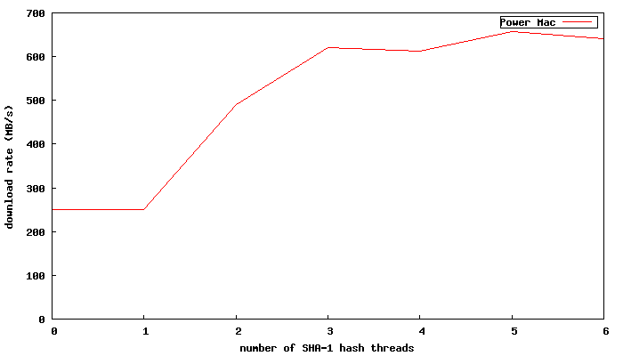

The typical design of bittorrent clients is to run SHA-1 hashing of piece data as it’s being written to disk (typically in a disk thread). Doing this helps keeping a lot of things simple. The disk cache and the disk operations are all synchronous, including the SHA-1 hashing. Whenever the disk cache decides to flush blocks, they typically are in-order, which allows for a single SHA-1 pass over the buffers as they’re flushed.

However, if the network and disk drive is not the bottleneck (say you’re on a 10 GigE network and uses SSD drives) hashing in a single thread will be the bottleneck.

In the experimental libtorrent\_aio branch I’ve rewritten the disk cache to be fully asynchronous, to support asynchronous disk I/O, so to make the hashing asynchronous essentially came for free. It’s still configurable whether to run hashing in the disk thread, or in one or more separate threads. There might still be good reasons for embedded devices to not spawn extra threads if there’s no chance of SHA-1 ever being the bottleneck, or for machines that don’t have multiple cores anyway.

hash threading speedup. 30 peers

In this test setup, download rate more than doubled by using 3 hash threads as opposed to 1.

The bottleneck that’s hit at 3 threads (causing the speedup to not increase with more threads) is the network thread’s socket receive calls. The network thread could be parallelized but it would be a lot more complicated, and probably require fine-grained locking.

---
