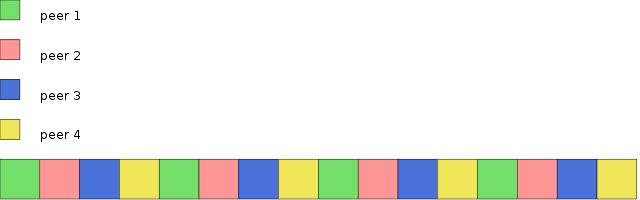

Deciding how many outstanding requests to keep to peers typically is based on the bandwidth delay product, or a simplified model thereof.

The bandwidth delay product is the bandwidth capacity of a link multiplied by the latency of the link. It represents the number of bytes that fit in the wire and buffers along the path. In order to fully utilize a link, one needs to keep at least the bandwidth delay product worth of bytes outstanding requests at any given time. If fewer bytes than that are kept in outstanding requests, the other end will satisfy all the requests and then have to wait (wasting bandwidth) until it receives more requests.

If many more requests than the bandwidth delay product is kept outstanding, more blocks than necessary will be marked as requested, and waste potential to request them from other peers, completing a piece sooner. Typically, keeping too few outstanding requests has a much more severe impact on performance than keeping too many.

On machines running at max disk capacity, the actual **disk-job** that a request result in may take longer to be satisfied by the drive than the network latency. It’s important to take the disk latency into account, as to not under estimate the latency of the link. i.e. the link could be considered to go all the way down to the disk platter of the machine blocks are being requested from. The network latency is just part of the full latency to reach the disk. This is another reason to rather over-estimate the latency of the network connection than to under-estimate it.

The latency for a disk read on a machine saturated with disk requests may be seconds.

Also keep in mind that while uploading pieces, each request message will experience serialization and queueing delay as those pieces are sent out by the modem. This delay can also reach seconds (uTP attempts to mitigate the queuing delay though).

A simple way to determine the number of outstanding block requests to keep to a peer is to take the current download rate (in bytes per second) we see from that peer and divide it by the block size (16 kiB). That assumes the latency of the link to be 1 second.

```
num_pending = download_rate / 0x4000;
```

It might make sense to increase the assumed latency to 1.5 or 2 seconds, in order to take into account the case where the other ends disk latency is the dominant factor. Keep in mind that over-estimating is cheaper than under-estimating.

Just like each peer has certain pieces of a torrent available to upload, each peer also has a disk cache with certain pieces in. Just like bittorrent client strive to evenly distribute pieces among peers (to improve trading ability and resilience) in order to maximize performance, peer’s disk caches should be kept as distributed as possible. The more evenly distributed the cached pieces are, the higher overall cache hit ratio is possible (for the entire swarm) since less cache size is “wasted” by being duplicated by two peers.

One simple way of striving toward this goal is to, for fast peers, request entire pieces at a time. The typical bittorrent cache pulls in a few extra blocks following the one that was requested, as a *read-ahead*. When requesting an entire piece, this read ahead cache strategy will maximize its cache hit rate.

Compare this to the other extreme, where you request the entire piece from 4 different peers, perfectly interleaved. In this case, all 4 peers may pull in the whole piece into their caches, and their cache hit rate will be low. See figure below:



blocks of one piece being requested from 4 different peers, causing all 4 peers to (likely) cache this whole piece

The logic in libtorrent switches into the request-whole-pieces mode when a peer sends blocks fast enough to send an entire piece in 30 seconds.

---
