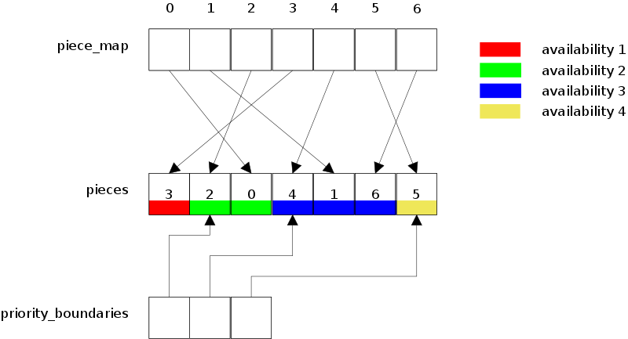

Wednesday, November 9th, 2011 by arvid

One of the key algorithms in bittorrent is the rarest-first piece picker. It is vital to bittorrent’s performance that the piece picker fulfills both of these requirements:

* The rarest piece is picked (from the client’s point of view of the swarm)
* If two or more pieces have the same rarity, pick one of them at random

The reason to pick a random rarest piece is to always strive towards evening out the piece distribution in the swarm. Having an even piece distribution improves peers’ ability to trade pieces and improves the swarm’s tolerance to peers leaving.

The operations of the piece picker are:

1. pick one or more pieces for peer *p* (this is to determine what to download from a peer)
2. increment availability counter for piece *i* (when a peer announces that it just completed downloading a new piece)
3. decrement availability counters for all pieces of peer *p* (when a peer leaves the swarm)
4. increment availability counters for all pieces of peer *p* (when a peer joins the swarm)

Overall, it is fairly safe to assume that operation 1 and 2 are going to be, by far, the most common ones.

First of all, technically, the piece picker doesn’t actually pick pieces, it picks blocks (16 kiB parts of pieces). This means it needs to keep state on partially picked pieces. It also means it should, among pieces of equal rarity, prefer to pick from a piece that already has outstanding requests (i.e. is partially picked). Keep in mind that partially downloaded pieces are wasteful, the sooner they can be completed, the sooner they can be uploaded to other peers.

There’s a special piece picker mode called *end-game mode*. If all piece have been picked or are completed, we enter the end-game mode. In this mode, each peer that we are ready to request more blocks from, requests a single block that has already been requested from someone else. This ensures that the download doesn’t get stuck on a single slow peer. Picking only one block at a time (i.e. disabling pipelining of block requests) ensures that the redundant download is kept low.

What data structure should one use to make picking pieces really fast?

Now, the typical data structure would be a list of buckets. Each bucket represents a piece rarity and the bucket is full of piece indices to pieces with that rarity. The buckets with piece indices are shuffled.

With a data structure like this you simply iterate the list from beginning to end, down into each bucket, whenever you find a piece the peer has, you dive down into that piece to pick blocks. Let’s call this the *pieces* list.

Here are a few observations of this data structure.

* when diving down into a piece, to pick blocks, we need a fast lookup to find the downloading piece object, the object that keepstrack of the state of each block. This can be a hash table mapping ***piece\_index -> struct downloading\_piece***.
* iterating a list of lists may not be optimal from a cache coherency point of view. To mitigate this, all buckets could be flattened into a single list, with a separate list containing indices to the rarity boundaries.
* in order to give preference to pieces that are already partially downloaded or partially requested, we need to introduce more “rarity levels”. For example rarity 0 and 1 could both represent availability of 1 but currently downloading and not downloading respectively. Since it’s no longer actual rarity (or availability), let’s call it *priority*. **priority = availability \* 2 + !partial**.
* in order to not make the rarity update operations *O(n)* (i.e. a linear search to find where the piece is) we need a separate index, that maps *piece\_index -> list\_index* (where list\_index is the index into the pieces list)*.*This can simply be an array, one entry per piece, with an index into the pieces list where that piece lives.

The piece picker’s data structure can be considered a *multi-index container*. That is, a data set which has multiple indices, optimized to do lookups based on different properties of the objects.

In this case, the object is a piece and we want to look it up either based on priority (when scanning in priority order, starting with the lowest values going up) or based on their actual piece index when modifying their rarity.

Each piece object needs to have at least the following state:

* the index where this piece can be found in the shuffled priority list
* the availability of this piece (that is, the number of peers that has it)
* whether or not this piece is partial (i.e. has outstanding requests or is partially completed)

This data structure could be illustrated with the following code snippet:

```
struct piece_pos {
   int peer_count; // availability
   int state; // partial or not (i.e. is there an entry in downloading)
   int index; // index into piece list, -1 means we have it
}; 

std::vector<piece_pos> piece_map; // piece_index -> index into pieces
std::vector<int> pieces; // pieces sorted by priority
std::vector<int> priority_boundaries; // indices into pieces

struct downloading_piece {
   int index; // piece
   // for each block; open, requested, writing or finished state
   std::vector<int> block_state;
};

std::unordered_set<int, downloading_piece> downloading;
```



Illustration of the relationships between the lists in the piece picker

Finding a piece rare piece is then just a matter of iterating **pieces** until we find a piece that the peer we’re picking from has. Pieces that cannot be picked are removed from **pieces**, to avoid iterating over them. This includes pieces we already have and pieces that have been fully requested. To pick a piece (not block) can be illustrated by this pseudo code:

```
int pick_piece(bitmask& have) {
   for (int p : pieces) {
      if (!have[p]) continue;
      return p;
   }
   return -1; // in this case we may have to enter end-game mode
}
```

Once we have the piece, we either look-up the **downloading\_piece** object, or create a new one (and update the state in **piece\_map**). In the downloading\_piece we mark the blocks we pick as requested, to avoid picking them again.

Incrementing the availability of a piece, can be illustrated by this pseudo code:

```
void inc_refcount(int piece) {
   int avail = piece_map[piece].peer_count;
   priority_boundaries[avail] -= 1;
   piece_map[piece].peer_count += 1;
   int index = piece_map[piece].index;
   int other_index = priority_boundaries[avail];
   int other_piece = pieces[other_index];
   std::swap(pieces[other_index], pieces[index]);
   std::swap(piece_map[other_piece].index, piece_map[piece].index);
}
```

This function swaps this piece with the border piece of this piece priority bucked, and then decrements the boundary index to make it belong to the priority bucket one level up. The dec\_refcount() function is similar but moves it down, towards lower availability buckets instead.

This operation is not extremely cheap, especially not when having to do it for every piece, every time a peer leaves and joins the swarm. When faced with having to update the availability of many pieces there are two optimizations:

* don’t include seeds at all, but simply keep track of the number of seeds in a separate counter. When a seed joins and leaves, it’s just a matter of incrementing and decrementing the seed counter.
* When it seems like we’re updating pieces more often than picking them, set a **dirty** flag, indicating the whole data structure needs to be rebuilt, and rebuild it if needed before the next piece pick.

This yields a generally fast piece picker, and is essentially what’s in libtorrent (+a few extra features). However, there are still at least two cases that are not very optimized:

* If the churn of non-seeds is high, and the request rate is high, the whole data structure has to be rebuilt for every request.
* If we have few pieces (the pieces list contains almost all pieces) and we’re requesting from a peer that have very few pieces, it may take a while to come across a piece the peer has. In situations like these, it would be more efficient to simply build a list of all pieces the peer has and order those by availability.

Posted in [algorithms](https://blog.libtorrent.org/category/algorithms/)
**|**
 [No Comments](https://blog.libtorrent.org/2011/11/writing-a-fast-piece-picker/#respond)

Tags: [algorithm](https://blog.libtorrent.org/tag/algorithm/), [bittorrent](https://blog.libtorrent.org/tag/bittorrent/), [performance](https://blog.libtorrent.org/tag/performance/)

---

### Leave a Reply [Cancel reply](/2011/11/writing-a-fast-piece-picker/#respond)

You must be [logged in](https://blog.libtorrent.org/wp-login.php?redirect_to=https%3A%2F%2Fblog.libtorrent.org%2F2011%2F11%2Fwriting-a-fast-piece-picker%2F) to post a comment.
