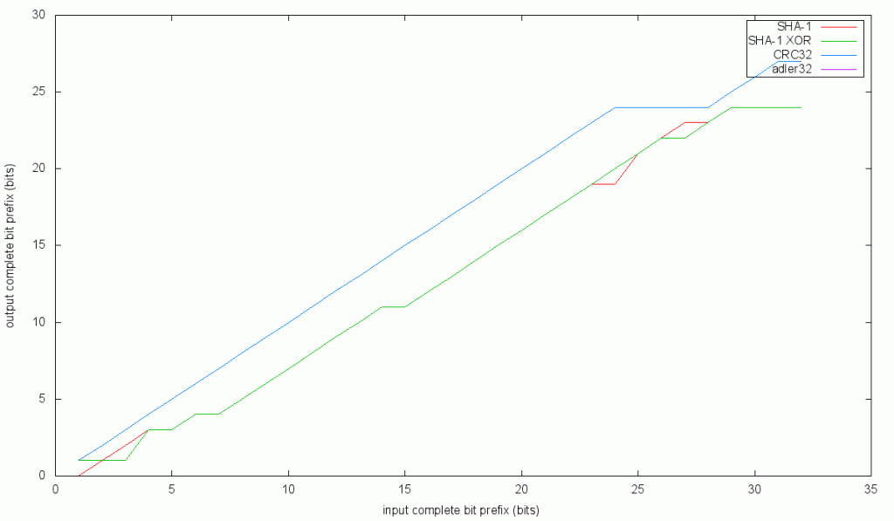

One of the vulnerabilities of typical DHTs, in particular the bittorrent DHT, is the fact that participants can choose their own node ID.

This enables an attacker to deliberately place themselves at a locaton in the DHT where they know they will be responsible for storing some specific data. At that point, there are a few naughty things that can be done, for example:

1. lie and say the data doesn’t exists whenever someone asks, in order to make the information unavailable
2. lie and insert your own data. For instance, insert a non-bittorrent peer in the peer list of a very popular torrent and cause tens of thousands of bittorrent peers try to connect to it. Causing a SYN-flood, potentially DDoSing that address.

One thing to do to mitigate this (there are many ways) is to force nodes in the DHT to only pick from a small set of node IDs, specifically available to them. One simple way to implement this scheme is to tie the node ID one has to choose to ones IP address. The assumption is that IP addresses are hard to change and a somewhat limited resource. An attacker can be assumed to not have control of all IP addresses.

One naive implementation of such scheme would be to require all nodes to pick the SHA1 hash of their own external IP as their node ID. In order to deal with multiple nodes behind the same external IP, behinde a NAT, one can throw in a small random component.

So, let’s revise it to be the **SHA1(IP + r)**, where **r** is a random number in the range [0, 7].

Now people behind a NAT can have unique IDs, and attackers are limited to choosing between **8 \* IPs** node IDs (where IPs is the number of IP addresses the attacker controls).

This turns out to not quite be strict enough. An attacker could conceivably control a /16 IP block. In such case, the attacker could choose from 65535 \* 8 = 524280 node IDs. That’s roughly half a million. Given that the current bittorrent DHT has somwhere between 4 nad 8 million nodes, you could quite likely have at least one node that definitely would fall within the 8 closest nodes (the DHT stores data on 8 nodes close to the key of the data, to gain redunancy).

In order to further restrict the number of node IDs one can pick from large IP blocks, one can apply a mask to the IP, where high order (more significant) octets have more bits masked out. This way, the smaller IP blocks have more overlap in their available node IDs, and the total number of IDs available as your IP block grows, grows slower than the number of IPs you gain access to.

This is scheme is described in more details [here](http://libtorrent.org/dht_sec.html "here").

This may seem like a fairly robust plan. However, there are some issues. In order to understand them, we first need to understand the basics of how the DHT routing works.

**routing**

The properties of DHTs, in this case kademlia, relies on node IDs being completely evenly distributed across the node ID space. If any restrictions are to be put in place, it’s crucial that the node IDs are still evenly distributed.

Routing in kademlia could be described (somewhat simplified) as matching one bit at a time, starting at the most significant bit. Matching each bit takes (on average) one hop, or one lookup-request. This means that overall, you halve the distance to your target for every hop.

In order to preserve this ***O(log n)*** lookup complexity property, it’s important that bits be evenly distributed in node IDs. The more significant (lower bit number) the more important it is that all possible bit combinations exists in the node ID prefixes.

By *complete bit prefix*, I refer to a number of bits in a prefix to a set of IDs, where every  
combination of bits is present, within that prefix.

For example, given the following integers:

```
0010001001
1100010010
1001101001
0110001010
```

The largest complete bit prefix is 2 bits. Within the first 2 bits, 00, 01, 10 and 11 are represented among the integers. Considering the first 3 bits, there are not 2^3 unique prefixes, so that prefix is not complete.

For the DHT routing to function properly, the entire node ID size needs to be a complete bit prefix. That is not to say that there needs to be 2^160 node in the DHT, but that it is possible to have any combination of all 160 bits.

The default specification of having every node choose their own ID at random satisfies this requirement. Every possible node ID can exist.

With a rule requiring nodes to pick the hash of their (masked) IP, there will be less than 4.3 billion different node IDs available in the world. This is clearly a lower number than 2^160. Thus, we can conclude that the scheme outlined above would potentially impact the DHT routing, and potentially break our ***O(log n)*** lookup complexity.

Using the term *entropy* loosely, one can conclude that we’re putting 32 bits of entropy into SHA1, and we take 160 bits out. Clearly we won’t have 160 bits of entropy. What if we would just take a 32 bit prefix of the SHA1, and let the nodes choose the remaining 16 bytes at random?

Clearly the random bytes would have the desired property of allowing all possible combinations. But would the SHA1 prefix?

It’s not at all obvious that hashing all possible 32 bit numbers would yield SHA1 hashes also covering the entire 32 bit space. In fact, it does sound like that would be somewhat unlikely. Intuitively, one could think of the 32 bits of entropy put into SHA1 being spread across 160 bits. Just taking the prefix actually cuts down on entropy.

Let’s run an experiment. If we would hash every possible 32 bit number, what would the output digests complete bit prefix be? Let’s generalize it. If we hash exactly the integers with a complete bit prefix of *n*, what is the digests complete bit prefix size?

This problem is not too big to be brute forceable on a consumer desktop computer. It’s not trivial how to implement it though. The implementation I went with was to represent all values of the digests in a trie structure. I limited the digests to 32 bits, since we’re looking for a 32 -> 32 bit mapping, and my assumption was that it won’t be a perfect 1:1 mapping, and thus yield fewer bits in the output.

While testing SHA1, I also tested a few other mappings. For instance, in an attempt to “gather” the entropy from the SHA1 digest, I also tried to XOR all the 32 bit words of the output into a single 32 bit result. I also tested crc32 and adler32. Keep in mind that there’s no requirement that this function be one way. It just need to be a mapping to a uniformly distributed integer (with an as long as possible complete bit prefix).

Source code for this experiment is available on [github](https://github.com/arvidn/hash_complete_prefix "github").



It turns out that adler32 is completely useless in this regard. Its output is very non-uniform.  
crc32 does surprisingly well. The intuition about crc32 was that since it was designed to produce 32 bit output, it might be more likely to preserve all the entropy within that word, without spreading it out.

The upshot of this is that we can use no more bits from the hash of the IP than what this graph shows. Options for moving forward with a IP -> node ID mapping in the DHT:

1. Find another hash function that is closer to a 1:1 mapping of the bit prefix
2. Run the hash digest through whitening to condense the entropy
3. be satisfied with the 28 bits crc32 provides and go with that

---
