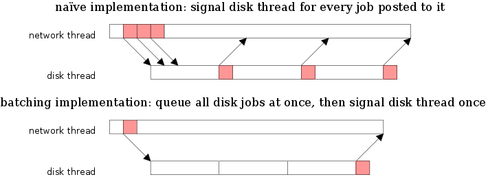
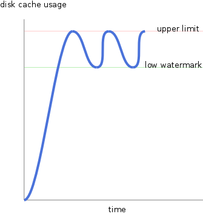

Monday, December 10th, 2012 by arvid

This article is an attempt to sum up a small number of generic rules that appear to be useful rules of thumb when creating high performing programs. It is structured by first establishing some fundamental causes of performance hits followed by their extensions.

A significant source of performance degradation on modern computers is the latency of SDRAM. While the CPU is waiting for a read from memory to come back, it is typically idling (this is mitigated by hyper-threading, to allow switching to another hardware thread, that may have work to do that doesn’t have an immediate dependency on RAM).

The main optimization to hide the latency of RAM, is layers of cache on top of it. Most modern CPUs have megabytes of cache.

Whenever the CPU switches context, the memory it will access is most likely unrelated to the memory the previous context was accessing. This often results in significant eviction of the previous cache, and requires the switched-to context to load much of its data from RAM, which is slow.

A context switch doesn’t necessarily need to be two threads sharing a single core. Making a system call, which is run in kernel mode, also switches context. One of the most important factors in the cost of system calls (these days, with SYSENTER), is the eviction of your cache by the kernel while executing the system call. There is an interesting paper on this, exploring the option of making system calls asynchronous, and deferred, to avoid having to switch context for every call [[1]](https://www.usenix.org/legacy/event/osdi10/tech/full_papers/Soares.pdf).

In order to avoid the cost of context switches, it makes sense to try to invoke them as rarely as possible. You may not have much control over operating systems’ system calls. There are a few cases where system calls have variants meant to reduce the number of calls you need to make, like writev() and readv() (or even better, pwritev() and preadv()). By passing in a vector of buffers, you don’t need to make one system call per buffer. By also passing in the read or write offset, you save one call to lseek() (as well as being thread safe).

However, you do have a lot of control over how your program is organized. Specifically how your threads communicate and how they behave. By batching work done by your threads you will get more work done per context switch, and you will improve performance.

Keep in mind the discreet nature of computers. You will wake up some times, there are only weak guarantees of when, and you have a chance to do some work. Do not rely on or expect to be able to wake up on a schedule, at least not with very high accuracy.

When batching work, it may be tempting to invent magic numbers. Things like: “when 100 jobs are accrued, wake-up and perform them, then go back to sleep”. Or perhaps: “wake up once every 100 ms and perform all jobs that have accrued during that time”.

A general rule of thumb is that magic numbers will not scale. They will either be a poor fit for slow throughput environments (e.g. waking up every 100 ms may be way too often and would waste CPU) or a poor fit for high throughput environments (it takes 1 ms to accrue 100 jobs, and waking up every millisecond is too often).

A typical manifestation of this problem is buffers with fixed sizes.

The latter is probably the most likely to be a problem. Computers are likely to become faster (at least more parallel) and throughput is likely to increase. Formulating your program so that it has to be configured for a certain era of computers or environment will require you to spend more time tweaking it.

The *granularity* of the computer is the default time slice size in the operating system’s scheduler. Ideally, a CPU would not context switch any more frequently than this (with the exception of context running out of work of course). This can typically not be achieved, when system calls are synchronous and considered context switches, but it is worth keeping in mind for the context switches one does have control over.

Every time a thread wakes up, the program has incurred a certain cost of context switching to it. To minimize this cost, it needs to be amortized over as much work as possible. Here’s rule of thumb 1:

> Always complete all work queued up for a thread before going back to sleep.

This rule is commonly applied in networking applications when a socket becomes readable. When a typical network application is notified of a socket becoming readable, the socket is repeatedly read until returning EWOULDBLOCK (i.e. the socket receive buffer is drained).

Not draining the readable socket would cause the thread to go back to sleep, just to immediately be woken up again, because one of its sockets is readable.

A basic property of a program whose batch size adapts to the load is that your work/thread-wakeup ratio will *increase* as your load increases. This will cause your wakeup cost to be amortized over more productive work, and increase your throughput.

A common pattern for allowing a program to take advantage of multiple CPU cores is to have threads or thread pools which can have work items queued up on them. The threading primitives used for job queues are typically condition variables or semaphores. Both of these primitives need to go all the way down to the kernel to wake up the thread waiting for jobs. Waking up, or signaling a thread to wake up, is not free. It should not be done more than necessary. There are at least two reasonable ways to limit the amount of redundant signaling between a producer and consumer thread. Which leads us to  rule of thumb 2:

> When awake, have your thread complete all its work before committing the work that it produced.

“Committing work” here refers to to diving down into the kernel to wake up the worker thread to perform queued work. Another way to phrase this is to commit the work produced by handling messages when the message queue is empty.

Many high-level event frameworks don’t expose the message queue at such a low level. There’s no hook to trivially trigger a commit each time the queue drained. This is true for boost.asio for instance. A way to implement a commit-when-drained handler on top of such message queue is to simply post a message to the queue whenever a new job is queued up (that will need committing later), unless such message is already in-flight. This calls your handler at least once per going through the whole message queue. The number of messages in the message queue will scale with load, and increase your batch sizes (and performance) organically.

Here’s a brief example of this concept:

```
void peer_connection::on_read(error_code const& ec
   , size_t bytes_transferred)
{
   // run logic to drain data from socket, handle messages and
   // queue up disk jobs triggered by them
   m_session.defer_commit();
}

void session::defer_commit()
{
   if (m_pending_commit) return;
   m_io_service.post(bind(&session::on_commit_jobs, this));
   m_pending_commit = true;
}

void session::on_commit_jobs()
{
   assert(m_pending_commit);
   m_pending_commit = false;
   // wake up disk thread to handle the jobs queued up on it
   m_disk_thread_pool.wake_up();
}
```

Another way to achieve adaptive batching in job queues is to only signal the thread to wake up when the number of jobs in the queue goes from 0 to > 0. As long as the number of jobs in the queue stays above 0, the worker thread(s) won’t go to sleep voluntarily (just by the scheduler granularity). This may achieve lower latencies for jobs, but may also scale the batch size less.



There is a cost associated with signaling a thread. The red portions of the threads represent that cost. Batching jobs and signaling fewer times, is more efficient.

libtorrent uses boost.asio as its event dispatch library. It has a straight forward message queue which ties callbacks to any event the application is subscribed to. In a bittorrent client, incoming messages on one peer connection may induce outgoing messages on other peers’ connections. For example, when receiving the last bit of a piece message form a peer, we may end up completing it and we should send HAVE messages to all peers, indicating that we now have this piece. Perhaps more importantly, multiple disk read job may compete and queue up 16 kiB of data on the send buffer each.

As established earlier, it is desirable to write these messages to sockets in as few system calls as possible. To achieve this, libtorrent *corks* all peers by default. Whenever a message is handled that puts data on a peer connection, it is not written to the socket right away. Instead, the connection is added to an uncork-set of peer connections. In the same way the on\_commit\_jobs() is called in the code snippet above, libtorrent uncorks all peers once the message queue is drained.

This has the benefit of potentially merging writes to sockets, and using fewer system calls to write. As the uncorking is done via a message posted to the queue, the cork batch size will grow organically with the load, and batch up more at higher loads.

When reading from sockets, the batching problem also manifests itself. How does one determine how large ones receive buffers should be? If they’re too big, you’re wasting memory and may not run well in a low bandwidth low memory environment. If the buffers are too small, you may need to wake up too often to drain them, wasting context switches in high bandwidth environments.

There are primarily two approaches to reading data from sockets (or files). The posix way is to be notified when a socket is readable, then repeatedly call read() on it until it is drained. To avoid repeated system calls, one can call ioctl() FIONREAD to first find out how many bytes are available and set ones buffer size optimally. This approach makes it easy to find the optimal buffer size, and not wake up any more often than necessary.

The second approach (win32) is to allocate a buffer up front and pass that into the asynchronous read call. This has the obvious advantage of not having to copy the data from the kernel buffer, but receive directly into the user supplied buffer. Other benefits include having a more predictable memory usage, where the application has some control over the growth of buffer sizes.

The problem of setting fixed buffer sizes is that it implicitly says: “this program will never receive more than *n* bytes while this thread is asleep”. Setting *n* to a reasonable number is impossible, it will either be too big or too small, depending on the environment. The first approach has the benefit of letting the operating system grow the buffer size as needed when the time between wake-up or download rate increases. The problem with the first approach is the need for copying the data.

Rule of thumb 3:

> Allocate memory buffers up front to avoid extra copying and maintain predictable memory usage.

How can we take advantage of the zero-copy API but still organically adapt our buffer size to the throughput of the machine and network?

Start by allocating a reasonably large buffer, receive asynchronously into it. If the number of bytes you receive fills the buffer entirely, you can assume you would perform better by increasing the buffer size. Conversely, if the number of bytes is significantly less than the buffer size, you may want to make it smaller, to save RAM. In order to make the buffer size converge in reasonable time, the adjustments should be multiplicative.

Another example of how to apply the rule of organically adapt the job batch size to the load is the disk cache in libtorrent. Peers that want to read from the disk need to allocate disk buffers (out of the disk cache) that are then submitted in disk read jobs to the disk thread pool. When peers are receiving payload that is destined for the disk, they also first allocate a disk buffer to receive the data into. Once a buffer is full, it is submitted as disk write job to the disk thread pool.

When the disk cache runs out of free buffers, peers may have to wait for buffers to be flushed to disk and made available before they can continue receiving more data from their sockets. These peers will be put in a queue and woken up at some later point when there are buffers available. The problem here is, how does one determine when to wake up these peers? There needs to be some low watermark, when the cache use drops below this line, we can wake up the peers and have them allocate their buffers and keep going.

Rule of thumb 4:

> When determining your batch size, think about what a natural division is without using magic numbers. It often involves the number of jobs (or bytes) one accrues during the time it takes for your thread to wake up after having been signaled, or during one scheduler time slice.

In the case of the low watermark for a disk cache, one obvious property one would want is to not wake up a peer, for it to just find itself unable to allocate another buffer, because they have all been allocated again. The low watermark should be at least as low as (max\_size – num\_waiters) buffers. i.e. no peer should be woken up until there’s at least one free block each. Setting the low watermark any lower runs the risk of unnecessarily delay peers from making progress. The number of waiters will depend on the load, and effectively adjust the low watermark accordingly.



If these rules of thumb were to be taken into account when designing an API for an operating system, you could end up with significantly higher performing programs.

This section highlights a few sub optimal interfaces to today’s operating systems.

Reading from and writing to UDP sockets is done one packet at a time. the vector read and write calls will coalesce the buffers into a single packet. When implementing a transport protocol on top of UDP, say uTP, one may have hundreds of packets prepared to be sent at a time, but still will need to call the send() function once per packet. The same thing goes for reading packets off of a UDP socket. There is no system call that returns all packets available on the socket. This is suboptimal and causes many unnecessary context switches.

Also, the posix networking API does not support the application allocating buffers up-front, and have the network card receive bytes directly into them. Windows’ API supports this, and can (at least in theory, if the driver supports it) avoid copying data from the kernel buffer into the user buffer. With an API that supports passing in pre-allocated buffers, it would be nice to have better support for communicating with the user level what a reasonable buffer size would be.

Many of the problems with requiring multiple system calls would be solved, however, if all system calls were asynchronous. In order to optimally take advantage of asynchronous system calls, message queue would probably have to be a central concept, with deep kernel support. This is not unlike epoll, kqueue, I/O completion ports, and solaris ports.

Imagine a world where all system calls are asynchronous, all events and system calls return values are posted onto a message queue and you could drain the message queue with a single interaction with the kernel.

The ideas presented in this article can be summarized as:

* The principle of organically adapt your job-batching sizes to the granularity of the scheduler and the time it takes for your thread to wake up.
* A mechanism to adapt receive buffer sizes for sockets, while at the same time avoiding to copy memory out of the kernel.
* Suggestions on how an operating system (and any API) can be shaped to better scale its performance
* Only signal a worker thread to wake up when the number of jobs on its queue go from 0 to > 0. Any other signal is redundant and a waste of time.
* Cork sockets in order to merge as many writes as possible
* A pattern to support committing-work-when-queue-is-drained to a high-level message queue

[1] <https://www.usenix.org/legacy/event/osdi10/tech/full_papers/Soares.pdf>

Posted in [algorithms](https://blog.libtorrent.org/category/algorithms/)
**|**
 [No Comments](https://blog.libtorrent.org/2012/12/principles-of-high-performance-programs/#respond)

Tags: [performance](https://blog.libtorrent.org/tag/performance/)

---
