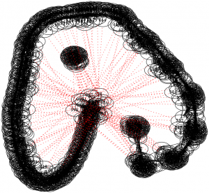
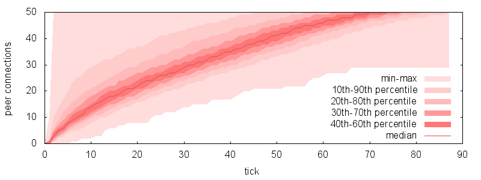
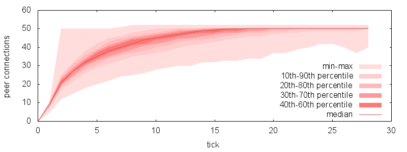
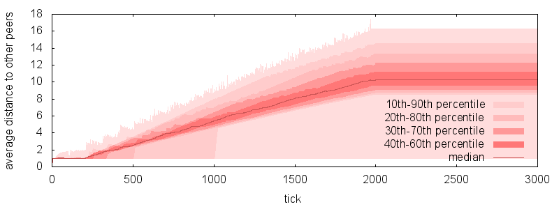
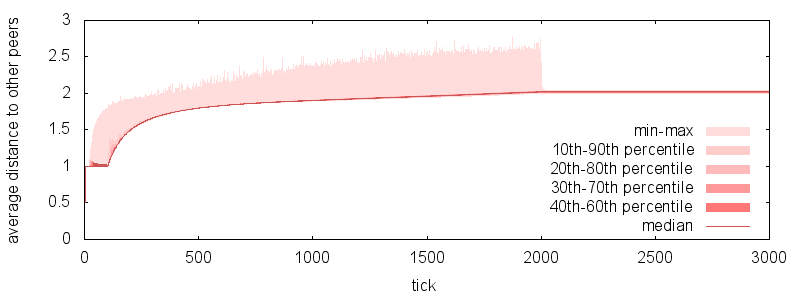
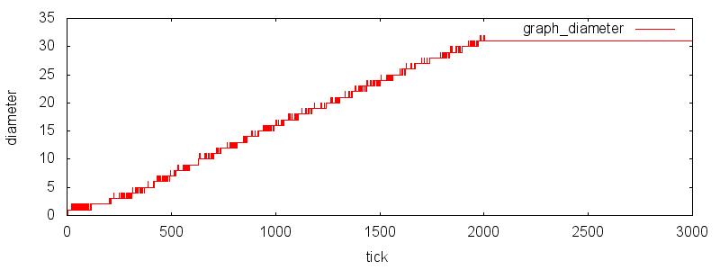
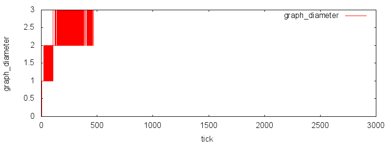

Monday, December 31st, 2012 by arvid

In bittorrent it is important to keep the swarm as evenly connected as possible. Clustering of peers may create bottlenecks for piece distribution and create a skewed market for trading pieces. Keep in mind that local piece availability is used as an approximation for global piece availability in the rarest-first piece picking algorithm. This post is relevant for most peer-to-peer systems, where having well connected peers is important.

Since the swarm bittorrent peers form is considered as a graph, peers will be referred to as both peers and nodes in this post.

The typical current (as of Dec. 2012) behavior among bittorrent clients is:

1. limit the number of connections per torrent to 50.
2. as long as a torrent has fewer than 50 peer connections, try to connect to more peers.
3. if an incoming connection is received for a torrent that already has 50 peers, the incoming connection is rejected.

This behavior, under perfect conditions, necessarily creates a complete graph of the first 51 peers. Any subsequent peer trying to join the swarm will fail, and only able to connect to each other. This is an extremely poorly connected swarm and would cause serious performance issues. “Perfect conditions” means everyone is connectable, the network doesn’t hick-up to break connections randomly and users stay online and connected consistently (as opposed to leaving and re-joining the swarm). This is believed to be extremely rare to happen in the wild however. In the real world people are behind NATs, which severely impacts the connectivity of peers.

To illustrate this, I wrote a simple [simulator](https://github.com/arvidn/peer_ordering) of bittorrent swarms (just the connections between peers in the swarm). Below is the end-state of the swarm. Each node is a peer and each edge is a connection.

Illustrates the initial complete graph along with every other peer joining after it. Dotted red lines are connection attempts, not established connections. From simulation of a 1000 peers swarm

Not only does this behavior cause poorly connected swarms, it also contributes to a very slow start-up time for a peer to join a swarm. If many peers in the swarm are at their connection limit already, a new peer will waste a lot of time connecting to them, just to be rejected and try some other peers. Finding the ones with open slots may take a long time.

It seems reasonable to ask of a system to function well under perfect conditions, and not require imperfection and noise to work at all. Also, it seems like a reasonable assumption that even with the noise of the internet, the performance issues caused by the current behavior still contribute to poor performance, it just does not break completely.

One way to ensure evenly distributed connections is to come up with a globally-agreed upon connection ranking function. The function would take two endpoints and return the priority of those two peers having a connection. It is important that the function would be commutative. Both peers should have the same understanding of the priority for them to connect (otherwise the swarm may never converge, and you end up with infinite peer churn).

With such function, peers could decide which peers to disconnect based on their priority, rather than the order in which they connected. i.e. when receiving an incoming connection while at the connection limit, instead of disconnecting the incoming peer, disconnect the peer with the lowest priority (which may be the newly accepted peer, but not necessarily).

With such scheme, the stable state at the end of the simulation instead looks like this:

Illustration of a 1000 peer swarm where peer connection has a global order. This is a well connected graph.

There are at least 3 potential improvements to gain from deploying this scheme:

1. The time it takes to join a swarm could be made considerably shorter
2. The swarm is much less likely to split into islands and likely to produce more even piece distribution
3. The swarm becomes a lot more robust against malicious attacks or client bugs resulting in lots of idle peer connections, reducing the effective connection limit in the swarm

Instead of connecting to peers randomly until finding ones with spare connection slots, clients could prioritize their known peers by their priority, and try high-priority peers first. This would significantly increase the chances that the connection attempts would result in an established peer connection, and significantly reduce startup time for such swarms.  
Going one step further, if trackers would tend to respond with high priority peers (based on who asked), it would further decrease the time it would take to find them.

To illustrate the startup time improvements, the simulator tracks each peer that joins the swarm (after the initial complete graph, since their startup time is tied to the peer join rate). These tracked peers record the number of connections they have at their **join time + *t***.  
The following graphs illustrates the distribution of peers based on how many peer connections they have at a certain number of simulation ticks after they joined.

The number of peer connections after joining the swarm, when peer connections are first-come-first-serve.

The number of peer connections after joining the swarm, when peer connections are ordered.

This simulation was run with a swarm of 1000 peers and each peer limited to 50 connections. The x-axis on the graph is the number of ticks since the peer joined the swarm, the y-axis is the number of connections the peer has established.

It clearly shows a significant speed-up in acquiring peers when joining a swarm. Half of the peers saturate their connection slots in about 15 ticks, versus 70 ticks with first-come-first-served behavior. 90% of the peers saturate the slots in 24 ticks, versus 86.

A reasonable metric for how well connected a node is would be the average distance (as the number of hops) to the other nodes in the graph. The following plots illustrates the distribution over time of the average distance to other nodes, from all node’s perspectives.

distribution of average peer distance over time in a 1000 peer swarm with first-come-first-serve connections

distribution of average peer distance over time in a 1000 peer swarm with connection ordering.

The reason why some nodes have an average distance of 1 is that the nodes belonging to the complete, disconnected island, have a distance of 1 to all of their reachable peers. The algorithm only takes reachable peers into account.

The diameter of the graph is another metric, which is the worst case distance between nodes. i.e. the longest shortest-path between two nodes in the graph. The diameter doesn’t describe the graph in as much detail though, since it’s just the worst case, regardless of how many peers experience this distance.

Diameter of the graph of 1000 peers and connections are first-come-first-serve.

diameter of the graph with 1000 peers with connection ordering.

The diameter is significantly lower when using peer connection ordering, and should contribute to wider and more uniform piece distribution. It might also make rarest-first piece picker more efficient since the local piece distribution likely matches the global distribution better.

One potential DDoS attack of a bittorrent swarm is to very rapidly make many connections to all peers in the swarm, and then pretend to not have any data and hold the connection slot for as long as possible. This narrows the number of paths in the network actually transferring data and could severly restrict the effectiveness of distribution.

With a global ordering function, an attacker could not distrupt a swarm any more than the portion of of IPs it has access to compared to the total number of peers in the swarm. This means as swarms grow, it becomes increasingly expensive to launch such attack. The reason for this is that the connection priority is tied to pairs of IPs, and each IP will only rank high with a small portion of other IPs. Any peer for which the attackers IPs rank low, would essentially be unaffected by the attack.

As a bonus to improve the robustness against this kind of attacks, the priority function could disregard some low order bits of the IP, meaning that attackers that launch attacks out of contiguous IP blocks would have an even smaller number of effective IPs.

There are reasons to believe that these kinds of attacks are launched in the wild, or at least attacks like it. See [cert.pl](http://www.cert.pl/news/5365/langswitch_lang/en "cert.pl").

Posted in [network](https://blog.libtorrent.org/category/network/), [protocol](https://blog.libtorrent.org/category/protocol/)
**|**
 [8 Comments](https://blog.libtorrent.org/2012/12/swarm-connectivity/#comments)

---

### 8 Comments
