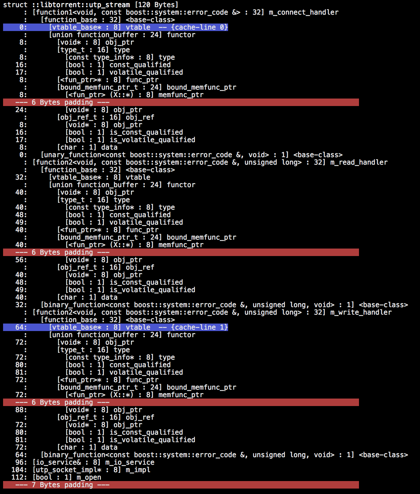
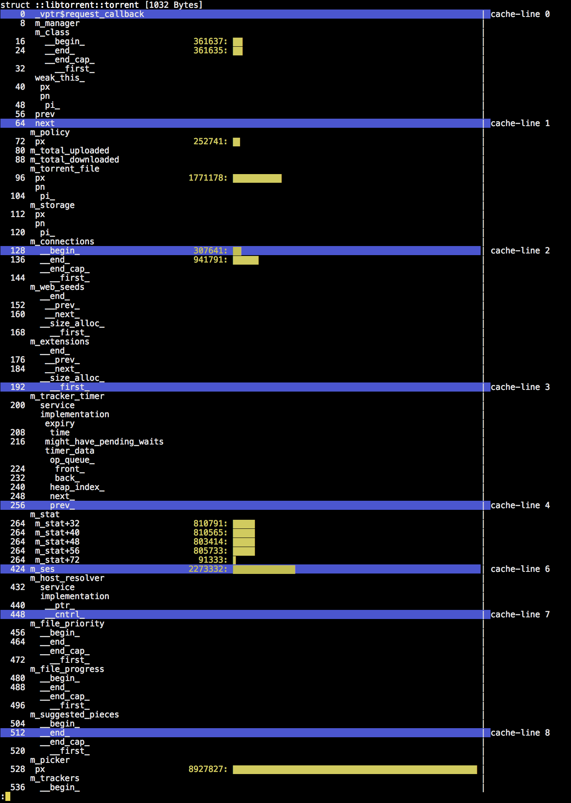

Monday, December 9th, 2013 by arvid

When optimizing memory access, and memory cache misses in particular, there are surprisingly few tools to help you. valgrind’s cachegrind tool is the closest one I’ve found. It gives you a lot of information on cache misses, but not necessarily in the form you need it.

About a week ago I started looking into lowering the memory cache pressure by just making my data structures smaller and have less waste. Waste primarily comes in the form of struct padding. To get a good understanding and intuitive visualization of the padding in the structures in libtorrent, I wrote a tool that visualizes them. It does essentially what the **dt** command does in windbg (but with some more features). As far as I can tell, this functionality is oddly missing from gdb (I’m talking about offsets of fields too, not just **ptype**).

Anyway, I ended up with an approach similar to pahole (which as far as I can tell is linux only). By reading the debug information from a program, I could reconstruct the structure layout of all types in the program. On top of this, I could deduce all padding and augment the cache line boundaries for good measure (assuming 64 bytes for now). The resulting output ended up like this:



screenshot of [struct\_layout](https://github.com/arvidn/struct_layout), visualizing structure layout with padding and cache line boundaries

As can be seen on this screenshot, compound type members are expanded to show the position of all sub fields, including all internal padding in types. With this information, it’s fairly simple to reorder members to make better use of space and minimize padding in structs.

To check it out yourself, see [struct\_layout](https://github.com/arvidn/struct_layout "struct_layout") (only tested on mac so far, it’s probably not hard to make it work on linux).

There are a few interesting things to note when optimizing structure layouts:

1. C++ has more relaxed requirements for non-POD types than for POD types. This allows the compiler to pack fields to a greater extent for non-POD types. specifically the tail-padding of a base class can be used for members in the derived class (as long as the base class is not a POD type).
2. There seems to be an awkward convention (by now it may just be a matter of staying ABI compatible) to not allow members to pack into each other’s tail-padding (of non-POD types). This is quite unfortunate, since it either encourages dirty hacks or adds potentially expensive padding to small types (a variant type is an example, where the type field may just need a few bits, but end up taking 8 bytes).

So, what does structure packing have to do with optimizing memory accesses? Well, really only lowering the overall pressure on the cache, by using smaller memory footprint. Not too impressive.

Where it really starts to matter is when you can move all your commonly used fields to the top of the structure, ideally within that first cache line. This is useful because if all hot fields are in the same cache line, it is more likely to stay in the cache, and you get a higher hit ratio. Keep in mind that any vtable pointer will be in the first cache line, so it’s likely to be somewhat hot already. (btw, this is all inspired by one of [Andrei Alexandrescu’s talks](http://channel9.msdn.com/Events/GoingNative/2013/Writing-Quick-Code-in-Cpp-Quickly), which I would recommend if you haven’t seen it).

In order to measure which fields are the hot ones, again I came up short of tools to do this, so I wrote one, [access\_profiler](https://github.com/arvidn/access_profiler) (only tested on mac, may need a little bit of hacking to work on linux, but probably not much).

Access profiler is a C++ library that provides one public class:

```
template<class T> access_profiler::instrument_type;
```

You’re expected to make your class derive from this, and specify it as the template argument ([CRTP](http://en.wikipedia.org/wiki/Curiously_recurring_template_pattern)). In return, [access\_profiler](https://github.com/arvidn/access_profiler) will catch all accesses to and from your type (as long as it was allocated on the heap, using its own new operator) and keep counters for them.

At your program shutdown an access\_profile.out is written in current working directory listing all instrumented types (by their type\_info name) along with access offsets and counters.

*It’s important to not profile debug builds, as member variable accesses won’t be optimized and cached in CPU registers to the expected degree.*

This file can be fed back into struct\_layout, to map the access offsets and counters to the actual field names of the types. The result ends up like this:



screenshot of struct\_layout visualizing the results from access\_profiler, visualizing which fields in a class are used the most.

This is an example of a type that probably could do with some reordering of fields. the m\_picker field is by far the most accessed one and should be put in the first cache line. This highlights the cost of deriving from multiple base classes with virtual functions. Each one adds another 8 bytes of vtable pointer in the first cache line (which is a lot, because you can only fit 8 of them).

The implementation of [access\_profiler](https://github.com/arvidn/access_profiler) is not entirely uninteresting. The way it works is to override **operator new** and **operator delete** for the instrumented type. It allocates all instances in their own pages (for small types that have many instances, this may be too expensive, so use it responsibly). This page is then protected to not be readable nor writable (with **mprotect()**). A signal handler is installed for SIGSEGV and SIGBUS. When these signal trigger, the signal handler looks up the address at fault, and if it’s in one of the instrumented pages it records the offset of the access in the type that was allocated in that page, unprotects the page, enables single step mode (trap mode) in the CPU flags register and returns.

The single step mode tells the CPU to execute one instruction and then fire a SIGTRAP interrupt. This is delivered to the process via another signal handler installed for that. It protects the page again, leaves single step mode and resumes execution.

As you can imagine, this is quite expensive, but I was surprised how it did not bog (a release build of) libtorrent down to a crawl. It used significantly more CPU, but otherwise it ran at full speed. For programs and workloads where the memory cache matters more this would presumably not be the case.

Posted in [optimization](https://blog.libtorrent.org/category/optimization/)
**|**
 [2 Comments](https://blog.libtorrent.org/2013/12/memory-cache-optimizations/#comments)

---

### 2 Comments

### Leave a Reply [Cancel reply](/2013/12/memory-cache-optimizations/#respond)

You must be [logged in](https://blog.libtorrent.org/wp-login.php?redirect_to=https%3A%2F%2Fblog.libtorrent.org%2F2013%2F12%2Fmemory-cache-optimizations%2F) to post a comment.
