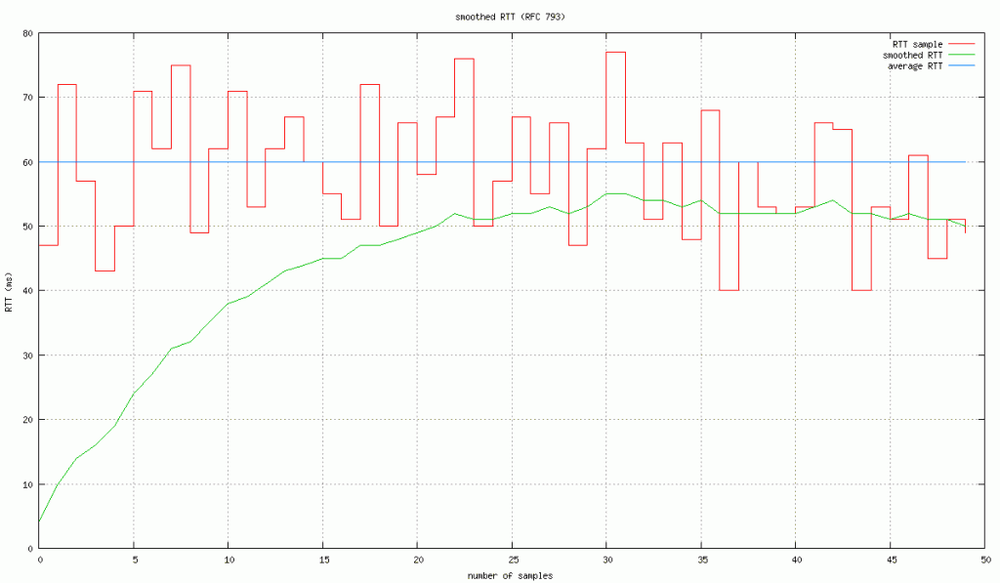
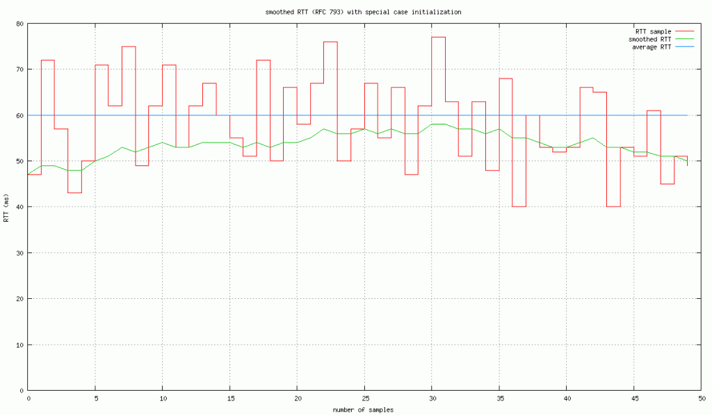
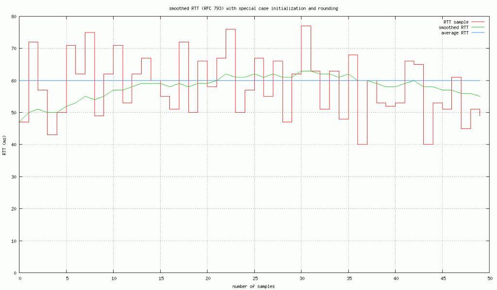
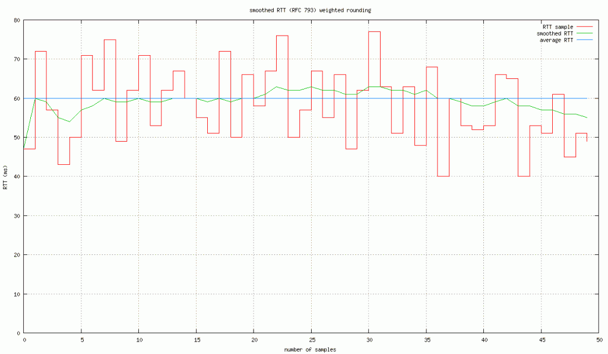

Many aspects of bittorrent requires maintaining an estimate of some kinds of samples. uTP keeps a running estimate of round-trip times for each connection. When streaming torrents, it is useful to keep an estimate of download time per piece (to know what a reasonable timeout is). This post takes a closer look at how to do this and what can go wrong.

The traditional algorithm for doing this is described in the [TCP specification (rfc 793)](https://www.ietf.org/rfc/rfc793.txt). It’s defined as follows:

```
SRTT = ( ALPHA * SRTT ) + ((1-ALPHA) * RTT)
```

SRTT is the smoothed round-trip-time, essentially the mean. RTT is the last round trip time sample, and alpha is the gain factor (suggested to be set to 0.8 – 0.9). This is how TCP determines its segment timeout, based on the average round-trip-time increased by a safety margin (this margin is made more sophisticated in [congestion avoidance and control](http://ee.lbl.gov/papers/congavoid.pdf)). What this does is blend the current RTT value into the SRTT value, ALPHA determines how much a single sample should affect the average.

A simplification of the formula is also presented in [congestion avoidance and control](http://ee.lbl.gov/papers/congavoid.pdf):

```
SRTT += (RTT - SRTT) * GAIN
```

Where GAIN is 1-ALPHA. When implementing this with integer arithmetic, be careful to make sure you preserve the precision. For instance, use fixed point values during calculation, or keep the internal state as fixed point.

This specific form of running average is known as [exponential moving average](http://en.wikipedia.org/wiki/Moving_average#Exponential_moving_average). It was presumably chosen for its simplicity and efficiency, but in the case of RTT, it may also respond to changes quicker.

The naive implementation of this initializes SRTT to 0 and then applies this formula to every sample. In an RTT example, you might end up with something like this:



naive implementation of running average

As one can see, the initial value of 0 really creates a strong bias and significantly delays arriving at a reasonable estimate of the average. Another issue is that the estimate converges far below the actual average.

The obvious improvement to this algorithm is to let the first sample we ever see initialize the SRTT variable, that would give us a more reasonable starting point. With this change the plot instead looks like this:



initializing using first sample

The converging point is still below the actual average. This is caused by integer arithmetic consistently truncating values. If instead we round the value at the end of the computation (SRTT is still an integer).



initializing using first sample and rounding

This solves the negative bias of the converging point. However, the first 10 samples or so, still have an unfortunate bias towards the (random) first sample.

One way to generalize the technique of initializing SRTT using the first sample, is to think of it as a gain of 1. The first sample we get has a gain of 1, because whatever SRTT is initialized to has no meaning. The second sample we get, the value of SRTT does have meaning, but since it only has a single sample in it, it should probably not have a weight of .9. Instead the second sample could have a gain of 1/2, the third sample a gain of 1/3rd and so on, until we reach our steady-state gain factor. With this algorithm, early samples have a more reasonable impact on the estimated average and adapts quicker, with fewer samples. The plot ends up looking like this:



using a gradually decreasing gain factor for the first samples

(the code for generating these graphs can be found [here](https://github.com/arvidn/moving_average)).

The c++ code can be found on [github](https://github.com/arvidn/moving_average). The meat of it though, is:

```
   void add_sample(int s)
   {
      s *= 64;
      int deviation;

      if (m_num_samples > 0)
         deviation = abs(m_mean - s);

      if (m_num_samples < inverted_gain)
         ++m_num_samples;
      m_mean += (s - m_mean) / m_num_samples;
      if (m_num_samples > 1) {
         m_average_deviation += (deviation - m_average_deviation)
            / (m_num_samples - 1);
      }
   }

   int mean() const { return m_num_samples > 0
      ? (m_mean + 32) / 64 : 0; }

   int avg_deviation() const { return m_num_samples > 1
      ? (m_average_deviation + 32) / 64 : 0; }
```

---
