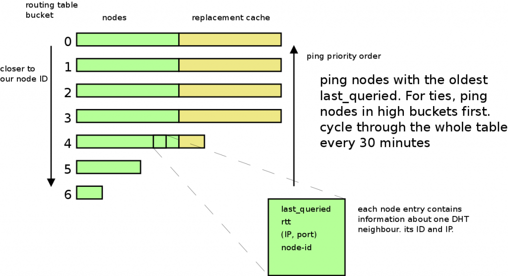
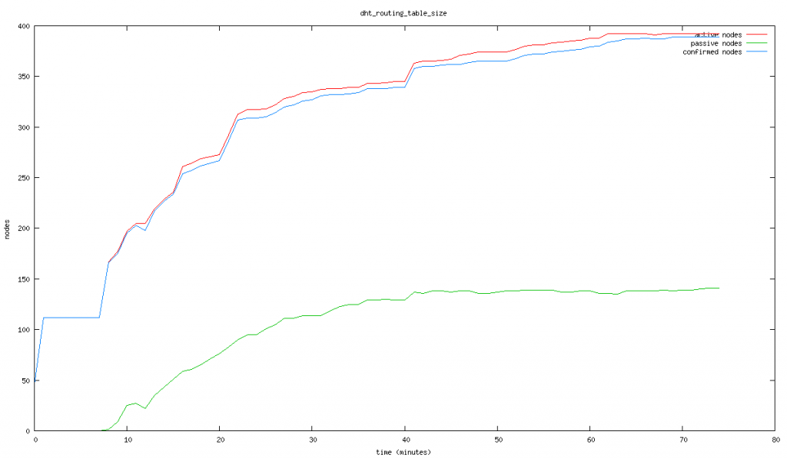
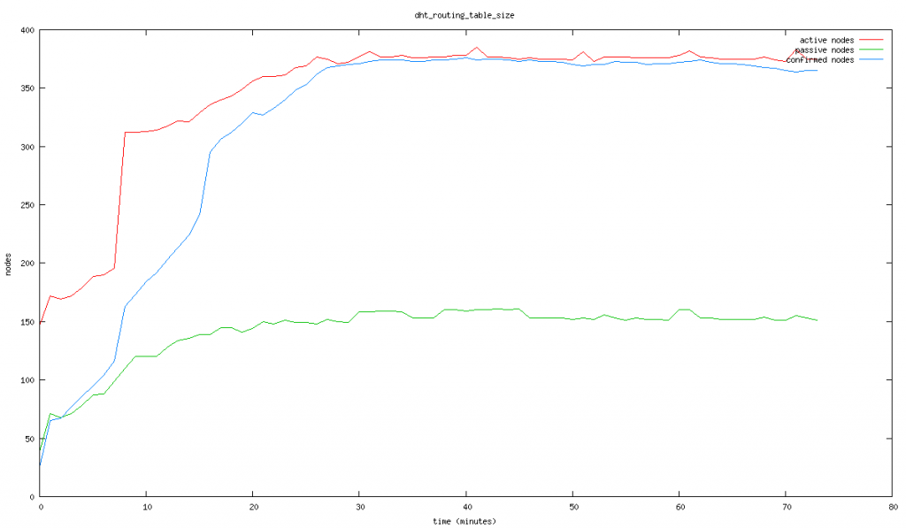
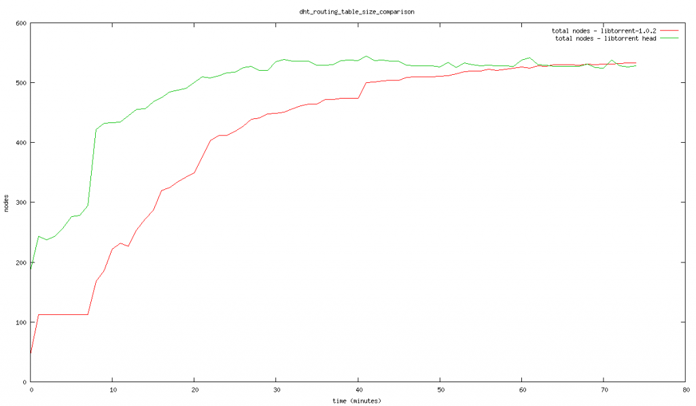
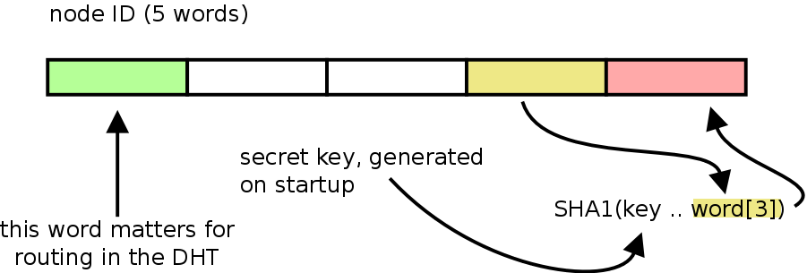

Friday, November 7th, 2014 by arvid

I’ve been working on performance improvements of the DHT recently that I would like to cover in this post.

One of the proposed improvements from the [sub-seconds lookups paper](http://people.kth.se/~rauljc/p2p11/jimenez2011subsecond.pdf) is referred to as NICE. It proposes replacing the method of maintaining the routing table buckets (see [kademlia paper](http://pdos.csail.mit.edu/~petar/papers/maymounkov-kademlia-lncs.pdf)) with directly pinging the nodes, the most stale node every 6 seconds. The traditional method is to issue a find-node lookup in buckets that are stale, i.e. have not seen any use in a long time.

The key benefit are:

* maintenance traffic becomes less bursty
* detecting stale nodes becomes more reliable
* there are fewer requests sent, and less bandwidth is used

However, one possible issue is that you now rely on actual use of the DHT (things like looking up torrents) to provide new nodes to keep the replacement buckets full when a stale node is detected and evicted from the routing table. With the original lookup of a random ID within the bucket being refreshed, at least we would learn about lots of new nodes that we could add to our table.

Instead of pinging nodes, we could send a *find\_node* request. This request will serve the same purpose; if we don’t hear anything back, increment the nodes fail counter, if we get a response back, we know it’s still alive. The benefit is that we **also** get fresh nodes back in the response.

Another risk is that you don’t push hard enough to get more nodes closer to our own ID, splitting the closest buckets and expanding our routing table all the way, or at least not doing that quickly enough.

What I do in libtorrent is to issue a *find\_node* request to the node that was pinged least recently (or has never been pinged at all). When looking for the most-stale peer, the search starts in the bucket closest to our own ID, the bucket that we may split if we get more nodes for. This creates a bias towards pinging nodes close to our own ID, when there are ties or when many nodes haven’t been pinged yet. It turns out this technique does a good job of quickly ramping up the routing table size. The target ID in each request is a random ID within the current bucket.

For this to work, the routing table needs to support having nodes that have not been pinged. Each node maintains the state of whether it has been pinged or not, along with a timestamp of when it was last queried (since those are mutually exclusive, a timestamp of 0 could mean not-pinged). It’s important to treat un-pinged nodes differently. They should not be included in responses to any request for instance. They are just there as placeholders until we’ve had a chance to ping them. Also, if we ever try to add a node that we *have* pinged, it should always trump an un-pinged one.

Whenever we receive a response from a node, for any reason, its last\_queried timestamp is updated. This will save us from unnecessarily refreshing nodes that are part of the normal usage of the routing table.

Every few seconds (the paper suggests every 6 seconds) ping the most stale node. The most stale is the node with the oldest timestamp. Any node that hasn’t been pinged is considered more stale than any pinged node. Before we have full routing table, there will be a lot of un-pinged nodes. The tiebreak for equally stale nodes is to prefer nodes in buckets close to our own node ID. This creates a bias towards expanding the size of the routing table early on. Once we have reached the “bottom” of the routing table, with a trail of un-pinged nodes behind us, we reverse and start pinging those nodes from bottom to top.

The DHT routing table maintenance

Pinging a node doesn’t mean literally using the ping DHT command, we still use find\_node as our ping, in order to get useful results back in case it’s online.

With a routing table that supports un-pinged nodes, there’s really no reason to not just dump all potential nodes onto it at any opportunity. Any lookup in the DHT will generate multiple round-trip and multiple requests. Each successful request responds with 8 nodes that typically takes you closer to the target ID. Most of those nodes will not be used as part of the search itself, but now they could still be added as un-pinged nodes to the routing table. They will be pinged eventually by the periodic pinging (that happens every 6 seconds).

This means, any DHT lookup – get\_peers, find\_node, get – will not only grow the routing table with the nodes successfully queried; it will grow it by all nodes it learns about.

On top of this, whenever we add a node from an external source (for instance, a bittorrent peer, that may also be a DHT node), we send a find\_node to confirm the node is alive. For these pings – without a bucket to pick an ID from – we use our node ID as the target. This creates another slight bias towards filling buckets close to our ID, which keeps the routing table healthy.

The graphs below illustrate the improvement in routing table maintenance. The first is from a run with current stable libtorrent-1.0.2, the second is head of the 1.0.x branch which includes the changes described in this post.

table size during bootstrap using libtorrent-1.0.2

routing table size during bootstrap using new maintenance strategy

The blue line of confirmed nodes is probably the most interesting one to compare. Note how it continuously keeps growing in the newer version. It also saturates the table size quicker (in about 28 minutes vs. 60 minutes in).

These tests were run with just two torrents, announcing once every 30 minutes.

Here’s a graph comparing the total number of nodes in the routing table over time.

comparison of the total number of nodes over time

Once switching over all ping messages to *find\_node*, it turns out that *get\_peers* has identical semantics. All uses of find\_node could be changed to instead send get\_peers. The only difference between find\_node and get\_peers is that get\_peers *may* also return bittorrent peers if the node we asked happen to have any for that info-hash. In these cases, the IDs we look up are not info-hashes, and thus will never result in any bittorrent peers, just nodes. Just like find\_node.

The benefit of using get\_peers is not obvious and not particularly important:

* It dilutes get\_peers requests for torrents with requests for random IDs.
* It provides a higher cost to eavesdropping on the DHT, because the signal to noise ratio of info\_hashes significantly decreases

To understand this, consider you want to eavesdrop on the DHT. What you do is spinning up as many DHT nodes you can, with as diverse node IDs as possible (and ideally diverse IPs). These nodes act normal except they collect info-hashes of torrents and peers that are likely to be on those swarms. All these info-hashes are put on a queue and looked up in the DHT. When connecting to a peer, we intend to use [ut\_metadata](http://bittorrent.org/beps/bep_0009.html) extension and possibly pex to get more information about it.

One way to optimize the collection of info-hashes is to consider any info\_hash argument in a get\_peers request to be a potential torrent. If receiving significantly more get\_peers requests, either we’ll have a lot more work to do to connect to them all and look them all up, or we have to disregard all get\_peers requests (for the purpose of collecting info-hashes). This would leave us with just announce\_peer, sent directly to us. This significantly limits the reach of each eavesdrop node in the network, and we would probably need more of them.

We can take this one step further. Whenever we ping a node (using a get\_peers request) we generate a random ID to use as the target/info\_hash. Instead of using a completely random ID, generate something that looks random but still has a recognizable property.

For instance, use the penultimate word of the random ID, combine it with a secret session key and hash it with SHA-1. Put the first word in the digest as the last word in the ID.

“random” target ID generation

Node IDs in the BitTorrent DHT are 160 bits, 20 bytes or 5 words. The DHT is not big enough to even need the full 32 bits of the first word for routing, so word 1-4 can be used for anything without affecting routing (as a side note, for topics of the first word, see [this](http://blog.libtorrent.org/2012/12/dht-security/) post).

With this scheme, if the bittorrent engine ever receives an incoming connection handshaking with an info-hash that has this signature / property, it’s a safe assumption that peer learned about it by snooping the DHT, and we can ban that IP.

Posted in [network](https://blog.libtorrent.org/category/network/), [protocol](https://blog.libtorrent.org/category/protocol/)
**|**
 [No Comments](https://blog.libtorrent.org/2014/11/dht-routing-table-maintenance/#respond)

---
