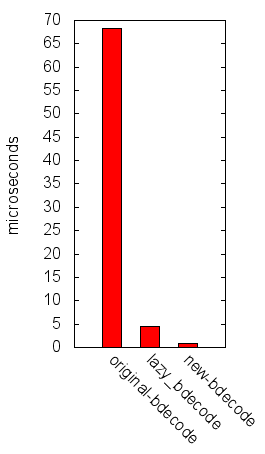
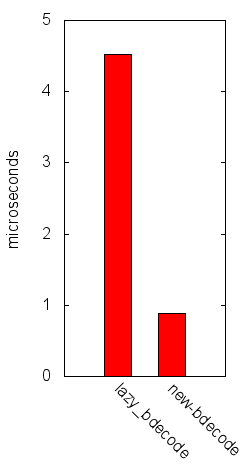
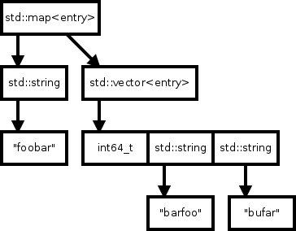
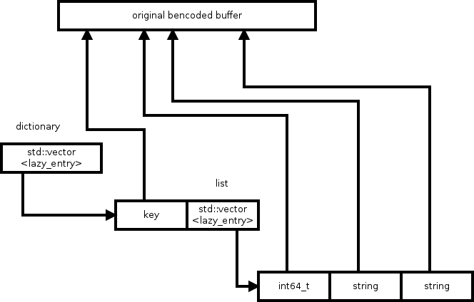
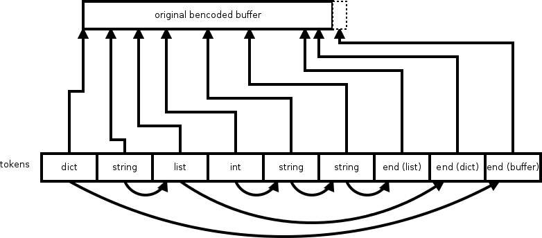

Monday, March 9th, 2015 by arvid

I have recently revisited the bdecoder in libtorrent, and ended up implementing a new bdecoder that is two orders of magnitude faster than the original (naive) parser. This is the 3rd decoder in libtorrent’s history, and I would like to cover its evolution of parsing bencoded data.

First off, the main reason for me to write a new bdecoder was CPU and memory usage. The previous decoders in libtorrent were simply not very efficient on either of those metrics.

Let’s look at the benchmarks first:

```
original bdecode()   68218 ns
lazy_bdecode()        4516 ns
new bdecode()          887 ns
```



time to parse the torrent file by decoder



comparison of the two fast decoders

This is the time it takes to parse a normal [.torrent file](http://cdn.media.ccc.de/congress/2014/h264-sd/31c3-6121-en-de-What_Ever_Happened_to_Nuclear_Weapons_sd.mp4.torrent) with the 3 different bdecoders in libtorrent. The new decoder beats the previously fastest one by a 5 times speedup. Yet, the previously fastest decoder was an order of magnitude faster than the original decoder. To understand these performance characteristics and what affects the performance of them, let’s dive into the implementations.

The original bdecoder copies all decoded data into a tree representing the structure of the bencoded message. At its core it has a variant type (libtorrent::entry) which can contain any of std::map, std::vector, std::string and int64\_t. When the parser encounters a dictionary, it instantiates a std::map and starts populating it with the data it parses. This means growing vectors, possibly copying parts of the tree while it grows when being built. The data structure is illustrated by Figure 1.



Figure 1: The data structure of the original bdecoder

This is the in-memory structure for the bencoded structure:

```
{ "foobar": [42, "barfoo", "bufar"] }
```

As you can see, this causes a lot of pressure on the memory allocator as well as a lot of memory copying. With many small allocations, it also causes a lot of memory overhead. Just adding characters to strings is 40% of the time parsing this test torrent file. Here’s an excerpt of a CPU profile:

```
Running     Time    Self Symbol Name
46828.0ms 100.0%     9.0 entry bdecode<char*>()
34946.0ms  74.6%    77.0   void bdecode_recursive<char*>()
33022.0ms  70.5%   762.0     void bdecode_recursive<char*>()
26699.0ms  57.0%  3431.0       void bdecode_recursive<char*>()
19053.0ms  40.6% 11702.0         std::basic_string<char>::push_back()
```

In an attempt to fix these problems, I implemented the lazy\_bdecode (and the corresponding lazy\_entry).

The idea behind the lazy decoder is to not copy any content at all. By building a structure that simply points into the original buffer, none of the actual payload is ever copied or moved. Other than the payload, the structure is fairly similar. A list is still a vector of items with pointers into the original buffer, a dictionary is also a vector with key value pairs, that just point into the original buffer for its data.

Not only does this save a lot of memory copying while building the data structure, it also uses significantly less memory overall. The original decoder use at least twice the amount of memory, since more or less everything in the decoded buffer must be copied into a smaller allocation. The lower memory pressure combined with more contiguous memory access for dictionaries provide a significant performance boost.

The data structure for the lazy\_entry is illustrated by Figure 2.



Figure 2: lazy\_entry data structure

The CPU hotspots of lazy\_bdecode() look like this:

```
Running    Time  Self Symbol Name
4070.0ms 100.0% 708.0 lazy_bdecode()
1208.0ms  29.6% 193.0   lazy_entry::list_append()
 616.0ms  15.1%  24.0     operator new[]()
 139.0ms   3.4%  56.0     szone_free_definite_size
...
 930.0ms  22.8%  47.0   lazy_entry::~lazy_entry()
 548.0ms  13.4% 145.0     lazy_entry::~lazy_entry()
 233.0ms   5.7% 131.0       szone_free_definite_size
  82.0ms   2.0%  23.0       free
...
 254.0ms   6.2% 135.0     szone_free_definite_size
  60.0ms   1.4%  15.0     free
...
 576.0ms  14.1% 144.0   lazy_entry::dict_append()
 212.0ms   5.2%   4.0     operator new[]()
  91.0ms   2.2%  42.0     szone_free_definite_size
  44.0ms   1.0%  12.0     free
...
 180.0ms   4.4% 104.0   szone_free_definite_size
 164.0ms   4.0% 164.0   parse_int()
 114.0ms   2.8%  11.0   void std::vector<lazy_entry*>::push_back()
  59.0ms   1.4%   9.0   void std::vector<lazy_entry*>::push_back()
```

Even though the amount of memory being moved around as the structure is built is small, there’s still a significant impact from the memory allocation and freeing as vectors grow. The number if memory operations hasn’t really changed, just the magnitude of them. The orange highlighted lines in the profile above are all time spent allocating or deallocating memory.

The new bdecoder is inspired by [jsmn](http://zserge.com/jsmn.html), a simple JSON parser. In some sense, jsmn is only half a parser. It tokenizes a JSON object into a pre-allocated C-array of tokens. It’s then up to the user to make any sense and interpret those tokens (which is non-trivial, and hence the second half of the problem). The new bdecoder parses the entire structure into a single flat buffer. Each item in the buffer is a token. Each token has a “pointer” back into the original bencoded buffer, pointing out where it came from. This is necessary to map values back onto the original buffer (when computing the info-hash for instance).

Note that *pointer* is in quotes. An actual pointer is typically 8 bytes these days, we don’t really need a full pointer there. Instead these “pointers” are just byte offsets into the original buffer. Along with this offset is the type of token as well as a “pointer” to the next item in the token vector. The next item is not necessarily the next item in the token stream, it depends on the structure. The next item may have to skip an entire subtree of tokens. The next item is an unsigned relative offset, the number of tokens to skip. You only need to skip forward.

This makes each token quite small, just 8 bytes each. This is to be compared with the nodes in lazy\_entry, which needs two pointers (one into the original buffer, and one to its own array of children), the size of the region in the bencoded buffer, type, size of allocation for children and capacity of its allocation. This all adds up to 32 bytes per node. This is all that’s required in the token structure:

```
struct bdecode_token
{
 enum type_t { none, dict, list, string, integer, end };

 uint32_t offset:29;
 uint32_t type:3; 
 uint32_t next_item:29;
 uint8_t header:3;
};
```

The internal structure is illustrated by Figure 3.



Figure 3: The data structure of the new bdecoder

Each node has an offset into the original buffer as well as a relative pointer to the “next” item in a sequence.

Storing the nodes in a single flat vector improves memory locality. Using very small token structures eases memory cache pressure. The memory operations are negligible (they don’t even show up in the profile). That is, all the time was spent actually decoding, as opposed to memory allocation/deallocation. One significant performance benefit this approach has is that when parsing multiple files or messages, the vector of tokens can be re-used. Saving the deallocation and allocation in between.

I’ve put up the bdecode functions as a separate project on github, you can find it [here](https://github.com/arvidn/bdecode).

Posted in [optimization](https://blog.libtorrent.org/category/optimization/)
**|**
 [2 Comments](https://blog.libtorrent.org/2015/03/bdecode-parsers/#comments)

---

### 2 Comments
