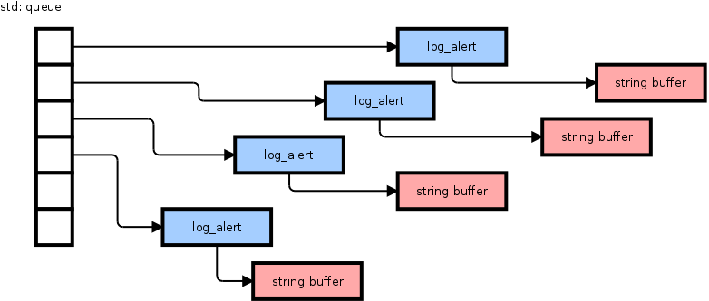
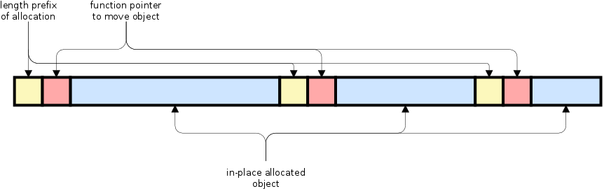
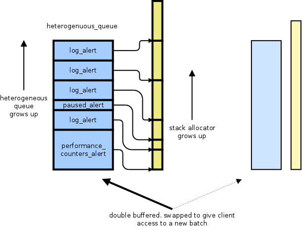

The main mechanism libtorrent uses to report events and errors to the client is via *alerts*. Alerts are messages as c++ objects with additional information depending on the type of message. Periodically clients [poll](http://libtorrent.org/reference-Session.html#pop_alerts()) for new alerts from a session object.

In the next major release of libtorrent detailed peer logging will be available as alerts. Previously this debug facility was only available as a build configuration which would write log files to pre-determined locations. This will hopefully make it easier for clients and users to troubleshoot networking and performance issues. When enabled, peers and torrents log a lot of messages, over 100 kiB/s while downloading. With that much data passing through the alert queue, it makes sense to think about how it works and ways to make it more efficient.

## the current alert queue

The current alert queue is literally a std::queue of pointers to alert objects. alert is the base class of all alert message objects. When a new message is posted, a new alert object is allocated and enqueued at the end of the queue. If the alert is a log message, the string associated with it also needs to be allocated.

When the client polls for alerts, the queue is swapped (under a mutex) and ownership is handed over. This way, alerts are not copied as they are delivered to the user. However, it *does* mean that all alert objects, the memory they allocate as well as the queue itself is, in constant churn. Because alerts are allocated and added to the queue that then is handed over to the client and released.

## the new alert queue

In order to optimize memory allocations, by consolidating them, the new alert queue uses a *heterogeneous queue*. That is, a vector-like data structure, but with the ability to push back objects of different types. These objects are still allocated in one contiguous memory allocation, just like std::vector would. In order to access the objects in a meaningful way, they need to all derive from a shared base class which allows RTTI or dynamic dispatch to distinguish the concrete type in the heterogeneous queue. The memory layout ended up looking like this:

A heterogeneous queue with 3 items in it.

The function pointer stored in the header of each element is required to copy or move the objects when the allocation needs to grow.

The heterogeneous queue significantly improves the performance of allocating and accessing alert objects. Since it’s all in a contiguous allocation, access is sequential and dense, which makes it cache friendly. However, alerts still contain members that allocate space on the heap, such as std::string. This is especially significant for log alerts, which are expected to be posted frequently. To mitigate those heap allocations there are 3 obvious alternatives.

1. Turn the strings into fixes size char arrays and try to make log messages short enough to fit
2. Allocate a variable number of bytes after each object, inside the heterogeneous queue (this is not uncommon in C, where you make the last element an empty array and allocate additional space for the struct).
3. Make alerts allocate their variable sized data on a separate stack-allocator.

The problem with (1) is that some log messages include strings that libtorrent has no control over, such as torrent names. There is no reasonable upper limit of how long such names could be. If the char arrays were padded with a lot of margin, it would defeat the gains of a dense sequentially accessed data structure. It would no longer be dense, possibly making accesses not sequential enough.

The problem with (2) is that it would be very hard to implement and still honor the abstraction set by the heterogeneous queue. Its interface (and implementation) would become very complicated and would no longer be able to hold arbitrary types, but only types that would accept some object to do allocations with.

That leaves option (3), which is what libtorrent implements, as illustrated by the figure below.

Also illustrated here is the last issue with the original alert queue, namely churn of the queue itself. Every time it was handed over to the client, ownership of it was also handed over (via swap()) and the client would free it. The new alert manager does not give up ownership of the queue, it simply keeps two alert queues and two stack allocators. Whenever the client asks for more alerts, the alerts the client received previously are invalidated and destructed and the queue they lived in is reused (without requiring any re-allocation) and pointers to the current queue are returned. The alert manager always add alerts and allocation to the queue that isn’t currently in use by the client.

---
