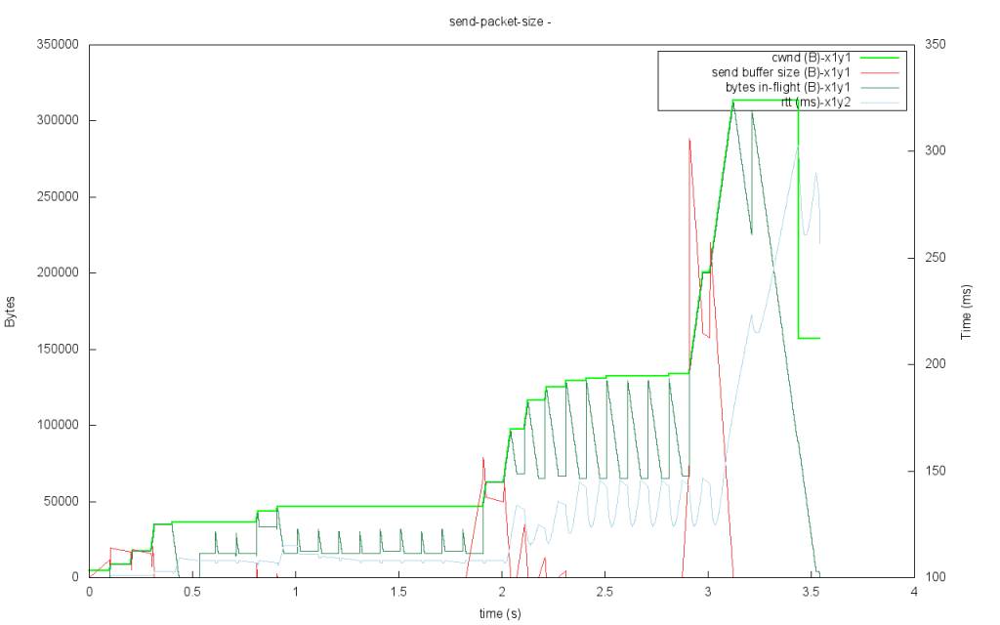
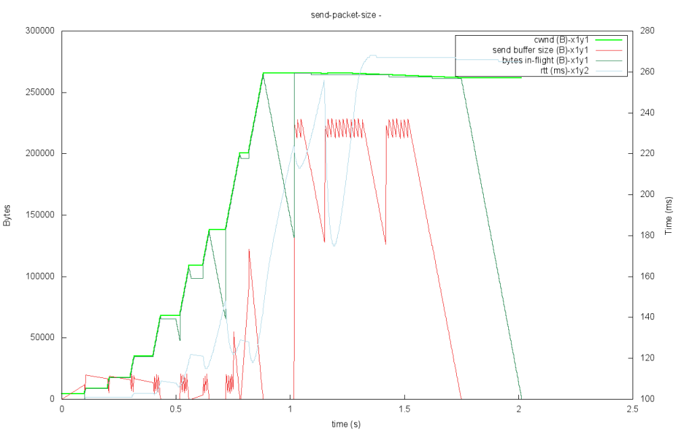

This post is a result of looking into a *slow-start* performance issue in [uTP](http://libtorrent.org/utp.html). Slow-start is a mechanism in TCP employed to discover the capacity of a link, before transitioning into the steady state regime of [additive increase and multiplicative decrease](https://en.wikipedia.org/wiki/Additive_increase/multiplicative_decrease). Slow start is employed on new connections and after time-outs (where the congestion window was set below the size of 1 packet). Slow start is implemented by increasing the congestion window size by the number of bytes that were ACKed by an incoming packet. Basically, for every byte that is ACKed, two more bytes are sent. This has the effect of doubling the send rate every round-trip.

## leave slow-start

Once there is a sign of congestion the slow-start mode is disabled. For TCP, this means there being a packet loss or reaching ssthres (a previously established stopping point for slow start). In uTP, experiencing a one-way delay above the target, or a loss or reaching ssthres all cause us to leave the slow start mode.

## slow-start issue in libtorrent

Here’s an example of the problem I saw on new seeding bittorrent connections over uTP (in [simulation](https://github.com/arvidn/libsimulator)):



Figure1: A new uploading bittorrent connection in slow-start mode

As illustrated by this graph, the congestion window (cwnd) does not grow exponentially. In fact, it stalls for several seconds combined. The light green line is the congestion window (the max allowed number of outstanding bytes), the dark green line is the actual number of outstanding bytes. Every round-trip where the dark green line does not saturate the congestion window, the congestion window won’t grow. There’s no point growing the window if there’s not enough data being sent to warrant it.

The red line in that graph hints at what the problem is.

The cause of the problem turned out to be the downloading client not requesting enough pieces, causing the seed to not have anything more to send. The downloading client would gradually increase the number of outstanding piece requests, but not fast enough to keep up with slow-start.

## bittorrent requests

At this point it’s a good idea to have a better understanding of the piece requests of the bittorrent protocol.

Fundamentally, performance in a bittorrent swarm is achieved by all peers also uploading content. The quicker you can turn around from having downloaded a piece until you can upload it, the better performance and the lower latency before you can take advantage of your upload capacity. In order to keep this turn aound low, we want to avoid having too many partially downloaded pieces at a time. To achieve that, a single piece is downloaded from multiple peers. Every time a block in a piece is requested, it’s allocated to that peer it was requested from.

If we were to request too many blocks from a peer at a time, most blocks would just sit around and be allocated for most of the time (because the actual download rate wouldn’t necessarily be high enough to complete them all immediately). Lots of allocated blocks blocks us from completing pieces quickly and will spread our download over multiple pieces in parallel.

We want to request as few blocks as possible from a peer, but not too few. If we request too few, and the requests don’t add up to the bandwidth delay product, we’re not fully utilizing the link. The number of outstanding requests we keep to a peer is proportional to the download rate we’re achieving from that peer. For more information on request logic, see [requesting pieces](http://blog.libtorrent.org/2011/11/requesting-pieces/).

```
target_request_queue = download_rate / block_size * download_queue_time
```

The peer’s notion of download rate is based on a running average of the number of bytes downloaded per second. Each second libtorrent wakes up to update its download rate metrics. This is what causes the second-long stalls of the congestion window, the amount of data available to the socket stays constant as long the download rate metric does. Because of this, and because it is low-pass filtered, the request queue size can’t keep up with the exponential increase (slow-start) of the underlying connection’s congestion window.

## bittorrent slow-start

By introducing slow-start at the bittorrent level, we can make the piece requests keep up with the uTP/TCP slow start. This basically means increasing the target outstanding request queue by one every time we receive a piece. i.e. when receiving a piece, send two more requests. This doubles the request rate every round-trip (similar to how slow-start increases its congestion window). While in slow-start mode, the target request queue size formula instead looks like this:

```
if (slow_start) target_request_queue += 1;
```

For every piece that’s received. While in slow-start, the regular updating of target\_request\_queue based on the download rate is disabled.

It’s not obvious when to leave slow-start at the application layer. At the transport layer there are clear indications of congestion (delay and packet loss), but these are not typically propagated up to the upper layers. In libtorrent I ended up measuring the number of bytes downloaded every second. Once this counter stops increasing, we leave slow-start. In practice, there’s some slack. When the number of bytes downloaded the last second increases by less than 10 kB/s compared to the previous second, we leave slow start. This is to tolerate noise in the transfer rates.



Figure 2: slow-start of a new seeding bittorrent connection over uTP, with fixed request slow-start on requesting client

In Figure 1, the connection leaves slow start about 3.2 seconds after it was connected. In Figure 2, it took less than 1 second to leave slow start. The 100ms “stalls” still in there are caused by the round-trip time (which was set to 100ms).

## conclusion

This problem is specific to protocols that use many small requests for downloads. For example, an HTTP request referring to a large file avoids this problem by making the server immediately have lots of data to send, and it can just keep pushing the file down the socket. However, if there instead are hundreds of small files, the requester need to make sure there are enough requests outstanding at any given time. Web servers sometimes limit the number of outstanding requests a client may have to quite few.

This problem was fixed in [libtorrent 1.0.6](https://github.com/arvidn/libtorrent/releases/tag/libtorrent-1_0_6) [[diff](https://github.com/arvidn/libtorrent/commit/578d353bce60b66ea886e623f5d0930411430d3c)]

---
