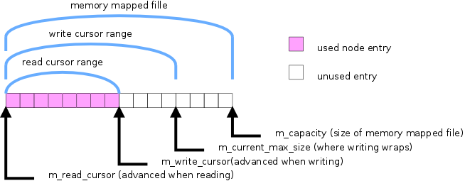
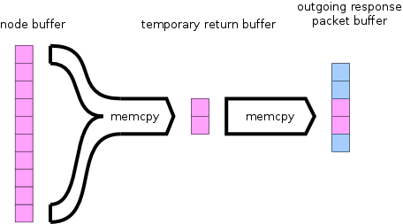
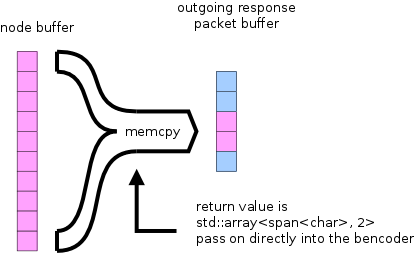

With the release of [libtorrent-1.1.1](https://github.com/arvidn/libtorrent/releases/tag/libtorrent-1_1_1), libtorrent finally got its very own default DHT bootstrap node, **dht.libtorrent.org:25401**. This post gives some background on the work that went into setting it up.

The [BitTorrent DHT](http://bittorrent.org/beps/bep_0005.html) (or *Distributed Hash Table*) is a single global network connecting all bittorrent clients. They form a network organized around their IDs. The DHT was initially used to maintain peer lists for torrents, where peers could add themselves and retrieve a list of other peers. Today, with the [put/get extension](http://bittorrent.org/beps/bep_0044.html), it can be used for much more interesting features, such as a [decentralized RSS-like-feed](http://bittorrent.org/beps/bep_0046.html).

Once you’re part of the DHT network, you will stay in touch with enough nodes to stay connected even as some go offline. However, how do you find the first DHT node? The one that can introduce you to the rest of the network. Since most regular BitTorrent peers are also DHT nodes, one way is via [local peer discovery](http://bittorrent.org/beps/bep_0014.html) and peers from bittorrent swarms (i.e. traditional trackers). If you don’t have a torrent though, those won’t do.

You can also use a well-known DHT node, that can help newcomers by introducing them to the network. This is where the [bootstrap-dht](https://github.com/bittorrent/bootstrap-dht) project enters (which I [wrote about](http://engineering.bittorrent.com/2013/12/19/dht-bootstrap-update/) some time ago). That is the piece of software run on BitTorrent Inc.’s DHT bootstrap node, **router.utorrent.com**.

Although the bootstrap-dht code was already fairly efficient, it was primarily written to handle a lot of traffic. I wanted to run it on a low-end machine so I made a few optimizations for it to make more efficient use of memory.

## bdecoder

I switched the bdecoder to use one that’s roughly 4x faster and has a lot lower heap pressure. Specifically, the newest bdecoder from libtorrent, covered in [this post](http://blog.libtorrent.org/2015/03/bdecode-parsers/) previously. [[PR](https://github.com/bittorrent/bootstrap-dht/pull/10)]

## node buffer

The node buffer is a ring buffer where all accepted nodes are stored (IP, port and node ID). Whenever responding to a request, nodes are copied from this buffer into the response packet. It has a read cursor determining which nodes are returned next. If this buffer is small, the nodes in there will be handed out repeatedly to a lot of newcomers, causing them to be hammered. To avoid returning a very small set of nodes to a large number of newcomers this buffer needs to be large. Ideally large enough so that any single node is only handed out once every minute or so. This is one of the most memory demanding parts of the dht bootstrap node, and I wanted to be able to run with a buffer that could potentially be larger than the amount of physical RAM.



*Figure 1. The node ring-buffer*

In this [Pull Request](https://github.com/bittorrent/bootstrap-dht/pull/12) I made the node buffer be allocated as a memory mapped file. This has the advantage that the kernel will be more aggressive in evicting pages when under pressure. The read pattern from this buffer is still sequential and should provide reasonable performance with read-ahead. Another advantage is that the node buffer will actually be stored on disk, and survive restarts of the node.

## ping queue

The other main component that uses a lot of memory is the ping queue. When we hear about new nodes, we don’t want to add them directly to the node buffer. The nodes in the node-buffer should have somewhat high quality, and be likely to still be around by the time we hand them back to requesters. In order to filter out nodes that either are behind restrictive NATs (and hard to reach from the outside) or that don’t stay online for long, we queue up ping requests. A ping request sits in the ping queue for 15 minutes, after which we ping to the node. If the node responds, we consider it good and we add it to the node buffer. 15 minutes was chosen to make it likely for a NAT pinhole to have timed out, since we want to avoid adding such nodes.

At thousands requests per second, a queue that can hold those nodes for 15 minutes clearly would have to be quite large. The original support for IPv6 was not meant to target low-end machines, so all entries in the queue had enough space to fit an IPv6 endpoint. This wastes 12 bytes per IPv4 entry, as illustrated by figure 2.


*Figure 2. The original ping queue (entries fit both IPv6 and IPv4 endpoints)*

To solve this I separated the queue into two separate ones, one for IPv4 nodes and one for IPv6 nodes. This is illustrated by figure 3. [[PR](https://github.com/bittorrent/bootstrap-dht/pull/16)]


*Figure 3. Two separate queues, one for IPv4 and one for IPv6*

## redundant memory copy

Another performance optimization I had been tempted to do for a while was to avoid some of the copying when building the response packet with nodes. This is illustrated in figure 4.



*Figure 4. Nodes are returned into a temporary buffer, which then is copied into the response packet*

In this [pull request](https://github.com/bittorrent/bootstrap-dht/pull/23) I made the node buffer return multiple *spans* rather than a heap allocated string with nodes. The [span<> class](https://github.com/bittorrent/bootstrap-dht/blob/master/src/span.hpp) is inspired by the [GSL](https://github.com/Microsoft/GSL) (guideline support library) and provides a surprisingly powerful abstraction. This change allows passing references to the memory ranges to be copied virtually free through multiple function calls. For instance, there’s another layer on top of the node buffer that fills the response up with *backup nodes* in case there aren’t enough nodes in the buffer. This is illustrated by figure 5.



*Figure 5. The temporary buffer is avoided by returning spans pointing directly into the node buffer*

Some redundant heap allocation and copying was removed by modernizing the signature of compute\_tid(). This function generates a transaction ID based on the destination IP address and a local secret value. This is a way to verify responses without storing state for each ping. Instead of returning a std::string, it now returns a std::array<char, 4>. [[PR](https://github.com/bittorrent/bootstrap-dht/pull/28)]

## upload bandwidth

The upload bandwidth used by the bootstrap node is roughly 3 times the download bandwidth. In other words, the incoming request packets are about a 3rd of the responses. The default is to return 16 nodes, which for IPv4 ends up being 26 bytes per entry (IP, port, node-id). 16 x 26 = 416 Bytes, on top of that there’s the overhead of the bencoding and the standard response fields.

The ping queue restricts IPs to only have a single entry in the queue at a time. It doesn’t make sense to queue up a single node multiple times, since the purpose is only to ping the node in the future, to determine whether to add it to the node buffer or not. One early observation was that around a third of all incoming requests were *duplicates*. This offers an opportunity to discriminate requests based on whether we’ve seen one from the same node recently.

```
time(s)    dup-ip   inv-msg   inv-src      resp   id-fail  out-ping  inv-pong     added    backup
     60       154         7         0       377        48       239         0        27         2
     60       110        14         0       329        33       264         1        35         1
     60       128         8         0       375        34       284         0        18         2
```

DHT implementations are expected to store its routing table across sessions, to be able to bootstrap without a DHT bootstrap server. If a node makes multiple requests with short intervals, it is very likely that it’s not actually important for it to receive a lot of nodes.

These patches [[1](https://github.com/bittorrent/bootstrap-dht/pull/35)] [[2](https://github.com/bittorrent/bootstrap-dht/pull/37)] simply responds with fewer nodes to a duplicate request. This brought down the upload bandwidth by roughly a 3rd.

The traffic to this dht bootstrap node has not yet ramped up, as [libtorrent-1.1.1](https://github.com/arvidn/libtorrent/releases/tag/libtorrent-1_1_1) was released quite recently, so it’s still early to tell whether more optimization work needs to be done. There are certainly more room for improving performance. Some ideas for future enhancement are:

* using [recvmmsg()](http://man7.org/linux/man-pages/man2/recvmmsg.2.html)/[sendmmsg()](http://man7.org/linux/man-pages/man2/sendmmsg.2.html) to minimize kernel calls when sending and receiving packets.
* moving the ping queue to a memory mapped file (to support it being swapped to disk).
* investigate whether progressing the node-buffer read cursor by fewer nodes than returned would lower memory pressure [[PR](https://github.com/bittorrent/bootstrap-dht/pull/27)].
* improve heuristic of whether a request is from a node bootstrapping, or just someone who added the bootstrap node to their routing table (that way upload capacity could be shifted towards those who need it the most)
* adding proper tests (using [libsimulator](https://github.com/arvidn/libsimulator))

If you’re interested in contributing, please check out the [bootstrap-dht](https://github.com/bittorrent/bootstrap-dht) project!

---
