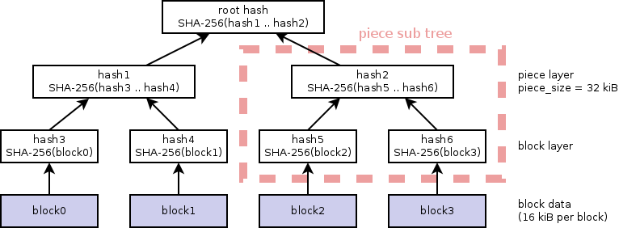

libtorrent-2.0 has just been released with a few major new features. One of them is support for [BitTorrent v2](http://bittorrent.org/beps/bep_0052.html).

Most of the specification [work](https://github.com/bittorrent/bittorrent.org/pull/59) of [BEP 52](http://bittorrent.org/beps/bep_0052.html) was done by the8472. The libtorrent support for bittorrent v2 was mostly implemented by Steven Siloti. [BiglyBT](https://www.biglybt.com) also has an implementation of BitTorrent v2 to be released in the near future.

BitTorrent v2 kick-started with an effort to transition away from SHA-1 as the hash function for pieces, shortly after google [announced](https://security.googleblog.com/2017/02/announcing-first-sha1-collision.html) having produced a collision. Given a new hash function would not be backwards compatible, a few other changes were proposed as well, while we were taking the compatibility hit anyway. This post describes the new features of the BitTorrent v2 protocol.

## SHA-256

The hash function for piece data was changed to SHA-256. One consequence of this is that hashes are 32 bytes instead of 20 bytes. In BitTorrent v2, the info-dictionary is also computed by SHA-256, which poses a compatibility challenge with the DHT and trackers, which have protocols that expect 20 byte hashes. To handle this, DHT- and tracker announces and lookups for v2 torrents use the SHA-256 info-hash truncated to 20 bytes.

This was one of the original rationales for creating a v2 protocol to begin with. It means that fundamentally a v2 torrent will be identified by a different hash than a v1 torrent, which would always create a separate swarm, even when sharing the same files. More on this later, under backwards compatibility.

## hash trees

In BitTorrent v1, pieces are hashed and the resulting hashes are included in the .torrent file/metadata (in the info-dictionary). In most cases, the piece hashes is the bulk of the size of .torrent files. To keep the .torrent file size within reason for large files, the piece size can be increased, meaning each hash represents a larger portion of the file. A consequence of large piece sizes is that if a hash fails, one has to re-download a larger portion of the file, until the piece passes the hash check.

An [old idea](http://www.bittorrent.org/beps/bep_0030.html) to improve both of these metrics is to use [merkle hash trees](https://en.wikipedia.org/wiki/Merkle_tree) to represent the piece hashes (originally implemented in [tribler](https://www.tribler.org/)). This keeps .torrent files small because all you need is the root hash of the tree. BitTorrent v2 uses merkle hash trees for pieces (but a different protocol that the one tribler implemented). This has the following advantages:

* The torrent metadata (specifically the info-dictionary portion of a .torrent file) becomes a lot smaller. This shaves off start-up latency when adding a magnet link, since fewer bytes need to be downloaded before the torrent download itself can start.
* Downloaded data can be validated on a block level. Meaning if a peer sends corrupt data, it can be discovered immediately and only 16 kiB need to be re-downloaded. The peer that sent the corrupt data can also be identified with certainty. This is a great improvement over the heuristics necessary to identify the bad peer in v1, sometimes referred to as [smart-ban](https://blog.libtorrent.org/2011/11/smart-ban/).

The leaves of the hash trees are always 16 kiB (the block size), regardless of the piece size. The concept of piece size still exists and is still used in the peer-wire protocol as it is today. e.g. in HAVE and REQUEST messages. However, instead of piece hashes actually being the hash of the content of the piece, it’s the root of the hash tree of the piece. i.e. a sub-tree of the full merkle tree.

In v2, the .torrent file must still contain these piece hashes (really the hashes in the merkle tree representing the piece-level). This helps distributing and storing the hashes so they don’t have to be recomputed when restarting a client that’s seeding. They’re also stored in the resume state. The .torrent file size is not smaller for a v2 torrent, since it still contains the piece hashes, but the info-dictionary is, which is the part needed for magnet links to start downloading.



Example tree for a file with 4 blocks and a piece size of 32 kiB (2 blocks per piece)

## per-file hash trees

BitTorrent v2 not only uses a hash tree, but it forms a hash tree for *every file* in the torrent. This has a few advantages:

* Identical files will always have the same hash and can more easily be moved from one torrent to another (when creating torrents) without having to re-hash anything. Files that are identical can also more easily be identified across different swarms, since their root hash only depends on the content of the file.
* All files will be aligned to pieces, which means there are implicit pad files after each file

This addresses a long-standing wish to more easily identify duplicate files, or finding multiple sources for files, across swarms.

## directory structure

As mentioned earlier, most of the time the piece-hashes take up the majority of space in the info-dictionary. The exceptions are torrents with a lot of small files; then it’s the file list that use the most space. In v1 torrents, file lists are expressed as a single list of files with full paths. In a torrent with a deep directory structure (or just directories with long names), those directory names will be duplicated multiple time, exacerbating the problem.

v2 torrents address this by using a more efficient encoding for the directory structure, with less duplication. Instead of a flat list, the directory structure is stored as a tree (using bencoded dictionaries). This results in directory names only being mentioned once. For example:

```
'files': [
    { 'attr': 'x', 'length': 12323346, 'path': [ 'F' ] },
    { 'attr': 'p', 'length': 62958, 'path': [ '.pad', '62958' ] },
    { 'attr': 'x', 'length': 2567, 'path': [ 'this is a very long directory name that ends up being duplicated a lot of times in v1 torrents', 'A' ] },
    { 'attr': 'p', 'length': 62969, 'path': [ '.pad', '62969' ] },
    { 'attr': 'x', 'length': 14515845, 'path': [ 'this is a very long directory name that ends up being duplicated a lot of times in v1 torrents', 'B' ] },
    { 'attr': 'p', 'length': 33147, 'path': [ '.pad', '33147' ] },
    { 'attr': 'x', 'length': 912052, 'path': [ 'this is a very long directory name that ends up being duplicated a lot of times in v1 torrents', 'C' ] },
    { 'attr': 'p', 'length': 5452, 'path': [ '.pad', '5452' ] },
    { 'attr': 'x', 'length': 1330332, 'path': [ 'this is a very long directory name that ends up being duplicated a lot of times in v1 torrents', 'D' ] },
    { 'attr': 'p', 'length': 45924, 'path': [ '.pad', '45924' ] },
    { 'attr': 'x', 'length': 2529209, 'path': [ 'this is a very long directory name that ends up being duplicated a lot of times in v1 torrents', 'E' ] }
    ],
```

Compared to the v2 file tree (this also includes the merkle tree root hashes):

```
'file tree': {
    'F': { '': { 'attr': 'x', 'length': 12323346, 'pieces root': 'd1dca3b4a65568b6d62ef2f62d21fcdb676099797c8aa3e092aa0adcb9a9f6a5' } },
    'this is a very long directory name that ends up being duplicated a lot of times in v1 torrents': {
      'A': { '': { 'attr': 'x', 'length': 2567, 'pieces root': 'f6e5b48ebc00d7c6351aafdec9a0fa40ab9c8effe8ac6cfb565df070d9532f70' } },
      'B': { '': { 'attr': 'x', 'length': 14515845, 'pieces root': '271d61e521401cfb332110aa472dae5f0d49209036eb394e5cf8a108f2d3fb03' } },
      'C': { '': { 'attr': 'x', 'length': 912052, 'pieces root': 'd66919d15e1d90ead86302c9a1ee9ef73b446be261d65b8d8d78c589ae04cdc0' } },
      'D': { '': { 'attr': 'x', 'length': 1330332, 'pieces root': '202e6b10310d5aae83261d8ee4459939715186cd9f43336f37ca5571ab4b9628' } },
      'E': { '': { 'attr': 'x', 'length': 2529209, 'pieces root': '9cc7c9c9319a80c807eeefb885dff5f49fe7bf5fba6a6fc3ffee5d5898eb5fdb' } }
      }
    },
```

## piece size

In v1 torrents, the size of a piece is not restricted by the specification. It doesn’t make much sense to have a piece smaller than the *block size* of 16 kiB, but it’s not disallowed. The vast majority of torrents that are created use a power-of-two piece size, but there are a few outliers that are not, but still divisible by 16 kiB. v2 torrents tightens up the requirements of piece sizes by requiring them to be:

* a power of two
* greater than or equal to 16 kiB

The main reason for this is for piece hashes to fit in the hash trees. Since the v2 piece hashes really are the merkle hash tree root of the piece, it must represent a power-of-two number of blocks.

## encoding

A .torrent file is a tree structure encoded with bencoding. In bencoding there are a few cases of single values with multiple possible encodings. An integer could be encoded with leading zeros or not, 0 could be encoded as negative 0. Those encodings have always been illegal, but parsers have historically been lenient and accepted them. Perhaps the most common example is how the keys in dictionaries are required to be sorted lexicographically. However, some torrent creators have failed to sort them, so clients have accepted them.

This primarily causes problems when round-tripping a bencoded structure. Once parsed, the specific order of dictionary entries, or the specific number of leading zeroes may be lost. So when re-encoding the structure, it may be different. If the dictionary that’s being round-tripped is the info-dictionary, the info-hash has changed and things will break.

libtorrent is now enforcing these restrictions by refusing to load any v2 torrent containing:

* an integer with any leading zeros (except 0 itself). e.g. **“i0004e”**
* a 0 encoded as -0. i.e. **“i-0e”**
* a dictionary where the entries are not sorted correctly. e.g. **“d1:B3:foo1:A3:bare”** (“A” should be sorted before “B”)

Enforcing these encodings also help make it more likely that two people creating a torrent from the same files, end up with the same info-hash and the same torrent.

## magnet links

The magnet link protocol has been extended to support v2 torrents. Like the **urn:btih:** prefix for v1 SHA-1 info-hashes, there’s a new prefix, **urn:btmh:** for full v2 SHA0256 info hashes. For example, a magnet link thus looks like this:

```
   magnet:?xt=urn:btmh:<tagged-info-hash>&dn=<name>&tr=<tracker-url>
```

The info-hash with the btmh prefix is the v2 info-hash in [multi-hash format](https://github.com/multiformats/multihash) encoded in hexadecimal. In practice, this means it will have a two byte prefix of **0x12 0x20**. It is possible to include **both** a v1 (btih) and v2 (btmh) info-hash in a magnet link, for backwards compatibility.

## backwards compatibility

All new features in BitTorrent v2 that are not backwards compatible have been carefully given new names, to allow them to coexist with the v1 counterparts. Hence, it’s possible to create *hybrid* torrents. That is, torrents that can participate in both a v1 and a v2 swarm at the same time, serving the same files.

A hybrid torrent has two info-hashes, one v1 SHA-1 hash one (possibly truncated) SHA-256 hash. This forms two swarms, or a segregated swarm. libtorrent marks peers as supporting v2 or not. This information is also relayed via a new peer exchange (PEX) flag.

A hybrid .torrent file includes both piece hashes as well as the tree root hashes for each file.

## testing

For anyone interested in testing a BitTorrent v2 implementation (or a client using libtorrent-2.0), you can find test torrents here:

A [v2 only torrent](https://libtorrent.org/bittorrent-v2-test.torrent)

```
magnet:?xt=urn:btmh:1220caf1e1c30e81cb361b9ee167c4aa64228a7fa4fa9f6105232b28ad099f3a302e&dn=bittorrent-v2-test
```

A [hybrid torrent](https://libtorrent.org/bittorrent-v2-hybrid-test.torrent) (backwards compatible)

```
magnet:?xt=urn:btih:631a31dd0a46257d5078c0dee4e66e26f73e42ac&xt=urn:btmh:1220d8dd32ac93357c368556af3ac1d95c9d76bd0dff6fa9833ecdac3d53134efabb&dn=bittorrent-v1-v2-hybrid-test
```

A [reference implementation](http://bittorrent.org/beps/bep_0052_torrent_creator.py) of a torrent creator in python.

---
